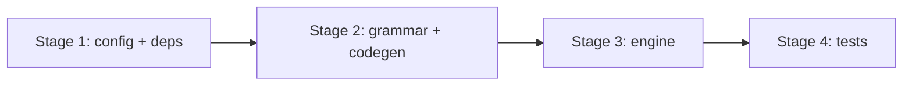

# Himark Proof of Concept -- Staged Implementation Plan

**Status:** Handoff plan, not yet implemented | **Spec:** [FOUNDATION.md](FOUNDATION.md) | **Goal:** prove the root model is implementable as an ANTLR4 grammar plus a small Python engine.

This document is self-contained: each stage can be executed by a fresh agent with no other context than this file and FOUNDATION.md. Stages are strictly ordered; do not start a stage until the previous stage's acceptance criteria pass.

## Scope

Covered: the three constructors (union `,`, subtraction `!{...}`, fold via nesting), the empty universe, and the two compressions ranges `{a..z}` and adjacency/product `{cat}{dog}`. The engine does both denotation (normalize a parsed query to flat universes of entries, faces, positional values) and matching (leftmost-greedy scan of text, returning spans, the entry and face matched at each product position, and the positional value of the whole match).

Excluded: splice (needs a naming surface FOUNDATION.md does not define), the capture-numbering surface, and the emit layer. These are separate layers per FOUNDATION.md's Scope section.

## Resolved spec decisions (binding for all stages)

These resolutions were made against FOUNDATION.md; implement them exactly and do not relitigate.

1. **Fold flattens.** A fold inside a fold merges its faces into the enclosing entry (quotient transitivity; depth is spelling, not structure). `{a,{b,{c,d},e,{f,g}}}` denotes two entries: faces `(a)` and `(b,c,d,e,f,g)`, collected depth-first left-to-right.
2. **Claim set = faces of currently live entries.** Union appends only unclaimed spellings. Subtraction removes entries and releases their spellings, so `{a,!{a},a}` denotes one entry. Values renumber automatically because they are assigned by final index.
3. **Subtraction matches by any face.** The subtracted universe is denoted independently (its own claim scope); a live entry is removed if any of its faces equals any face of the subtracted denotation. `{{a,A},!{A}}` is empty.
4. **Greedy order = leftmost-longest with backtracking.** At each product position, candidate faces are tried longest first, ties broken by declaration order (entry index, then face index). The first candidate that lets the rest of the product match wins. This is the canonical parse for non-uniquely-decodable face sets.
5. **Ranges** take single unescaped character endpoints only (`{ab..z}` is a syntax error), inclusive by code point; `lo > hi` denotes nothing (total, a no-op, consistent with the constructor no-op rules).
6. **Escapes.** Backslash before any character yields that character literally: `\{ \} \, \! \. \\`. No control escapes (`\n` is the letter `n`). `..` always lexes as the range operator, so a face containing two adjacent dots writes `a\..b`.
7. **Whitespace is never skipped.** A space inside braces is face text (regex-like). Top-level whitespace between universes is a syntax error.
8. **`{}` is legal** and denotes the empty universe. Nothing with an obvious denotation is rejected; source and AST stay faithful, and all normalization happens at read (denote) time, per FOUNDATION.md line 28.
9. **Positional value is mixed radix on both axes**, most-significant-first. For a product of universes with cardinalities $b_0, \ldots, b_{k-1}$ and matched entry indices $e_i$, the value is $\sum_i e_i \prod_{j>i} b_j$, which reduces to FOUNDATION.md's $\sum_i \mathrm{value}(p_i) \cdot b^{k-1-i}$ when all bases are equal. The face axis composes the same way over per-entry face counts.
10. **An empty universe anywhere in a product** makes the whole query match nothing.

## Repo facts (verified 2026-07-13)

- Greenfield: no source package exists yet. `pyproject.toml` already expects package dir `Himark/` (vulture `paths`, import-linter `root_package`).
- Python 3.14 in-project venv via poetry; pytest 9 and hypothesis are dev deps.
- `antlr4` CLI (antlr4-tools runner, Homebrew) and Java 26 are on PATH. The Python runtime `antlr4-python3-runtime` is NOT yet a dependency. Pin both tool and runtime to 4.13.2.
- `tests/test_lint.py` is a CI gate running ruff check, ruff format --check, ty, vulture, import-linter, and ast-grep over the whole repo, and `conftest.py` auto-runs ruff format/fix before every pytest session. Generated ANTLR code will fail these tools, so Stage 1 excludes `Himark/_gen` from every one of them BEFORE any generated code lands.
- ast-grep rules live in `static/rules/ast-grep/` (no-print, no-eval-exec, no-subprocess-shell, no-guarded-imports). Engine code must not use `print`, guarded imports, or bare `assert` (ruff S101 outside tests): raise exceptions instead.

## Stage 1 -- Toolchain and config

**Recommended agent:** Claude Code with Haiku 4.5. Mechanical, well-specified edits; no design judgment needed.

1. `poetry add antlr4-python3-runtime==4.13.2` (exact pin matching the generator version).
2. In `pyproject.toml`, under `[tool.ruff]` add `extend-exclude = ["Himark/_gen"]` and `force-exclude = true` (the second keeps direct-path invocations and the conftest auto-fixer off generated code).
3. In `pyproject.toml`, under `[tool.vulture]` add `exclude = ["*/_gen/*"]`.
4. In `pyproject.toml`, add a new table:

```toml
[tool.ty.src]
exclude = ["Himark/_gen"]
```

5. In `pyproject.toml`, add an import-linter contract (this also avoids import-linter's zero-contract error once the package exists):

```toml
[[tool.importlinter.contracts]]
name = "Engine layering"
type = "layers"
layers = ["Himark.match", "Himark.universe", "Himark.parser"]
```

6. In each of the four YAML files under `static/rules/ast-grep/`, add a top-level key (sibling of `rule:`):

```yaml
ignores:
  - "**/Himark/_gen/**"
```

**Acceptance:** `poetry install` succeeds; `poetry run pytest` still passes (the lint gate must stay green with the config edits in place and no package yet -- if import-linter fails because `Himark` does not exist yet, create `Himark/__init__.py` as an empty placeholder in this stage).

## Stage 2 -- Grammar and parser generation

**Recommended agent:** Claude Code with Sonnet 5. The grammar is small but the lexical subtleties (maximal munch `..` vs `.`, escape token, no-whitespace-skip) reward care.

1. Create `grammar/Himark.g4` with exactly this content:

```antlr
grammar Himark;

query    : universe+ EOF ;
universe : LBRACE (member (COMMA member)*)? RBRACE ;

member
    : CHAR RANGE CHAR   # RangeMember
    | BANG universe     # SubtractMember
    | universe          # FoldMember
    | face              # FaceMember
    ;

face : (CHAR | DOT | ESC)+ ;

LBRACE : '{' ;
RBRACE : '}' ;
COMMA  : ',' ;
BANG   : '!' ;
RANGE  : '..' ;
DOT    : '.' ;
ESC    : '\\' . ;
CHAR   : ~[{},!.\\] ;
```

Design notes: faces are multi-character runs assembled in the parser from single-character tokens, so `{cat}` is one entry spelled `cat`. Token-per-char makes `..` vs `.` trivial via maximal munch. There is deliberately no `WS -> skip` rule (decision 7).

2. Create `scripts/gen-parser.sh`, mark it executable:

```bash
#!/usr/bin/env bash
set -euo pipefail
cd "$(dirname "$0")/.."
antlr4 -v 4.13.2 -Dlanguage=Python3 -visitor -no-listener \
  -Xexact-output-dir -o Himark/_gen grammar/Himark.g4
touch Himark/_gen/__init__.py
```

The `-v 4.13.2` flag makes the antlr4-tools runner download and use the tool jar matching the pinned runtime (first run needs network and Java; both are present).

3. Run the script once. Commit everything it produces under `Himark/_gen/` (lexer, parser, visitor, `.tokens`, `.interp`, `__init__.py`) so later stages and CI never need Java. Regeneration workflow: edit the `.g4`, rerun the script, commit the diff.

**Acceptance:** `poetry run python -c "from Himark._gen.HimarkLexer import HimarkLexer; from Himark._gen.HimarkParser import HimarkParser"` succeeds, and `poetry run pytest` (lint gate) stays green, proving the Stage 1 exclusions work.

## Stage 3 -- Engine

**Recommended agent:** Claude Code with Opus 4.8 or Fable 5. This is the semantic core; normalization order, claim-set bookkeeping, and canonical-parse backtracking are where spec reasoning lives and where a weaker model will produce plausible-but-wrong code.

Four files under `Himark/`, layered `match -> universe -> parser` (the import-linter contract from Stage 1 enforces this).

### `Himark/parser.py` -- faithful AST

- Frozen dataclasses, nothing normalized: `Face(text: str)`, `Range(lo: str, hi: str)`, `Fold(universe: UniverseNode)`, `Subtract(universe: UniverseNode)`, `UniverseNode(members: tuple)`, `QueryNode(universes: tuple[UniverseNode, ...])`.
- `class HimarkSyntaxError(ValueError)`. Attach a custom ANTLR error listener that raises it, on both lexer and parser, after `removeErrorListeners()` (the default listener prints to stderr, which both loses errors and would trip the no-print rule if written by hand).
- A visitor subclass of the generated `HimarkVisitor` builds the AST. `ESC` tokens resolve to their second character (`text[1]`). A `face` node's text is the concatenation of its resolved tokens.
- Public: `to_ast(source: str) -> QueryNode`.
- Constraints: no `assert`, no `print`, no guarded imports; plain top-level `import` of the ANTLR runtime and of `Himark._gen` modules.

### `Himark/universe.py` -- denotation

Data model:

```python
@dataclass(frozen=True)
class Entry:
    faces: tuple[str, ...]  # ordered, nonempty, unique within the universe
    value: int              # its index after normalization

@dataclass(frozen=True)
class Universe:
    entries: tuple[Entry, ...]

@dataclass(frozen=True)
class Query:
    source: str
    universes: tuple[Universe, ...]  # most-significant-first
```

`denote(node: UniverseNode) -> Universe` is one left-to-right pass. Maintain `entries: list[list[str]]` and the claim invariant `claimed == set of all faces of entries`:

- `Face(text)`: if `text` unclaimed, append entry `[text]` and claim it; otherwise no-op.
- `Range(lo, hi)`: for each code point from `ord(lo)` to `ord(hi)` inclusive (empty when `lo > hi`), treat `chr(cp)` as a Face member.
- `Fold(universe)`: `inner = denote(universe)` (fresh claim scope; recursion is what flattens nested folds depth-first). Collect `inner`'s faces in entry order, keep only those unclaimed in the outer scope, claiming as you keep. If any survive, append them as ONE entry; if none survive, contribute nothing.
- `Subtract(universe)`: `doomed = all faces of denote(universe)`. Remove every live entry sharing at least one face with `doomed`, then recompute `claimed` from the survivors (this releases spellings, decision 2).

Finish by freezing: `Universe(tuple(Entry(tuple(faces), i) for i, faces in enumerate(entries)))`.

Public: `parse(source: str) -> Query` = `to_ast` then `denote` per universe. Parsing keeps the source string on the `Query` for repr/debugging.

### `Himark/match.py` -- leftmost-greedy matcher

- Precompute per universe a candidate list `[(face, entry_index, face_index)]` sorted by `(-len(face), entry_index, face_index)`. Denotation guarantees each face appears at most once per universe, so identification is unambiguous.
- `try_product(universes, text, pos)`: if no universes remain, succeed with `[]`. Otherwise iterate the first universe's candidates in order; for each face where `text.startswith(face, pos)`, recurse on the rest at `pos + len(face)`; first full success wins (decision 4). Return `None` on exhaustion.
- `match(query, text, start=0)`: try `try_product` at each position from `start` to `len(text)`; first success is the leftmost match; return `None` if none.
- `finditer(query, text)`: repeated `match`, resuming from each match's span end (non-overlapping; faces are at least one character, so no zero-width loop).
- Value computation, both axes mixed radix most-significant-first (decision 9): entry axis `value = value * len(u.entries) + entry_index` folded across positions; face axis `face_value = face_value * len(entry.faces) + face_index`.
- Result types: `MatchPart(span: tuple[int, int], entry: Entry, face_index: int)` with a `face` property, and `Match(span, parts: tuple[MatchPart, ...], value: int, face_value: int)`.

### `Himark/__init__.py` -- public API

Re-export `parse`, `match`, `finditer`, `Query`, `Universe`, `Entry`, `Match`, `MatchPart`, `HimarkSyntaxError`. `match` and `finditer` accept `Query | str` and parse strings on the fly.

**Acceptance (smoke, exact expected values):**

- `parse("{a,{a,A}}")` -> one universe, entries `[("a",), ("A",)]`.
- `parse("{a,{b,{c,d},e,{f,g}}}")` -> entries `[("a",), ("b","c","d","e","f","g")]`.
- `parse("{a,!{a}}")` -> zero entries.
- `match("{a,b}{x,y}", "zzby")` -> span `(2, 4)`, value `3`.
- `match("{a,ab}{b,c}", "ab")` -> parts spell `a` then `b` (backtracking), while on `"abc"` parts spell `ab` then `c` (greedy).
- `poetry run pytest` lint gate green (no asserts/prints in engine code, imports layered).

## Stage 4 -- Tests

**Recommended agent:** Claude Code with Sonnet 5. Test authoring from the case tables below is well-specified; the hypothesis properties need mild care.

- `tests/test_parse.py`: faithful AST (`{a,{a,A}}` keeps the nested fold node); escapes (`{\{,\!}` yields faces `{` and `!`); `{a.b}` is one face `a.b`; `{ab..z}` and a bare `!` outside `!{` raise `HimarkSyntaxError`; `{}` parses.
- `tests/test_denote.py`: the four smoke denotations above; fold-flatten equivalence `parse("{a,{b,{c,C}}}").universes == parse("{a,{b,c,C}}").universes`; `{a..e}` has five entries, `{a..a}` one, `{e..a}` zero; subtraction renumbers (`{a,b,c,!{b}}` gives `a` value 0 and `c` value 1); re-union after subtraction (`{a,!{a},a}` one entry); any-face subtraction (`{{a,A},!{A}}` empty); compression equivalence: `match("{a,b}{x,y}", "by").value == 3 == match("{ax,ay,bx,by}", "by").value`; positional value `match("{a,b,c}{a,b,c}", "cb").value == 7`.
- `tests/test_match.py`: leftmost (`{b}` on `"abc"` spans `(1, 2)`); greedy (`{a,ab}` on `"abc"` matches `"ab"`, entry 1); the backtracking pair from Stage 3 acceptance; empty universe matches nothing alone and as a product factor (`{x}{a,!{a}}` on any text); face identification (`{x,{b,B}}` on `"B"` gives value 1, face_index 1); face-axis value (`{a,{b,B}}{c}` on `"Bc"` gives value 1, face_value 1); finditer non-overlap (`{a}{a}` on `"aaaa"` gives spans `(0, 2)` and `(2, 4)`).
- `tests/test_properties.py` (hypothesis): union idempotence (a face list concatenated with itself denotes the same universe as the list alone); product index bounds ($0 \le \mathrm{value} < \prod_i b_i$ for a text built by concatenating one chosen face per universe -- do NOT assert the value equals the chosen entries, since non-uniquely-decodable sets may canonically parse differently, which is correct); range cardinality $\max(0, \mathrm{ord}(hi) - \mathrm{ord}(lo) + 1)$.

**Acceptance:** `poetry run pytest` fully green, including `tests/test_lint.py` (ruff check, ruff format --check, ty, vulture, import-linter, ast-grep).

## Stage flow



## Out of scope, recorded for later

Splice and capture numbering wait on their governing docs (HMK.md, ALGEBRA.md); the emit layer waits on ENGINE.md. Match strategy details beyond leftmost-longest canonical parse (e.g. alternative canonical orders) are an L2 concern per FOUNDATION.md's Scope section.
