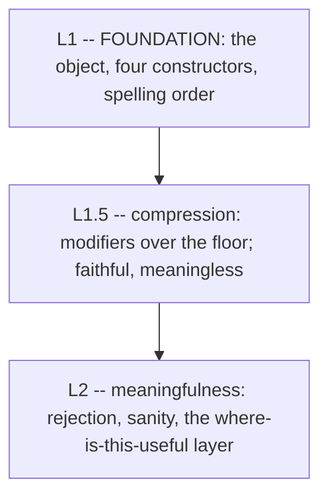

# Himark L1.5 -- The Compression Layer

This document specifies L1.5, the layer directly above the floor defined in [FOUNDATION](L1.md). It is not L2. L1.5 adds no axiom and no meaning: every construct here is *compression* in the sense of the floor's re-admission test -- notation for a universe the floor already denotes. Meaningfulness (is a query useful, is a range sane) remains an L2 concern; L1.5 inherits the floor's faithfulness and rejects nothing.

## Where L1.5 sits



L1.5 borrows three things from the floor without amendment:

- **Faithfulness** (FOUNDATION line 28): the source and AST are faithful. L1.5 rejects no operand and rewrites nothing at parse time. An operand of any length is legal and *must* denote, even when the result is enormous or nonsense. Footguns are the author's to fire; L1.5 is not the safety.
- **Compression, not capability** (FOUNDATION line 37): each L1.5 construct reduces to floor constructors (union, subtraction, fold, final segment) over the one object. It adds no denotational power. If a proposed L1.5 construct ever denoted a universe the floor cannot, it would be a new *axiom* and would belong in FOUNDATION, not here.
- **The one spelling order** (FOUNDATION line 11): shortlex, shorter first, ties broken code point by code point. Every cut L1.5 makes is a cut of that order.

## The modifier form

L1.5 introduces one surface form, the postfix **modifier**:

```
<operand> [ <func> <arg>  <func> <arg>  ... ]
```

The operand is a universe. Each `<func> <arg>` names a total function and its argument (itself a universe -- a range literal, a face list, whatever denotes). A bracket holds a **left-to-right pipeline** of them: `[where 8..12 pad 1..2]` applies `where 8..12`, then `pad 1..2` to its result. Every modifier is a universe-to-universe transformer, total and compression-only, so brackets chain without ever leaving the floor.

Two invariants keep the pipeline coherent:

- **Alphabets are plain lists; modifiers do all interpretation.** A universe is never anything but a faithful, ordered list of spellings (FOUNDATION line 10). `{a,b,ab}` is three entries, values 0, 1, 2 -- full stop. Any notion of "digit," "numeral," or "zero" lives in a modifier, never in the bucket. A modifier is what reads `{a,b,ab}` *as* base-3 digits; the alphabet itself neither knows nor collapses anything.
- **The operand is the ambient alphabet for the whole bracket.** The value-set flows left to right between modifiers, but every modifier reads its base and its zero from the *bracket's operand*, not from the previous step's output. In `{0..9}[where 8..12 pad 1..2]`, both `where` and `pad` take their digits and their zero glyph `0` from `{0..9}`; the intermediate `8, 9, 10, 11, 12` is a value-set, not a new alphabet. This is exactly why `{0..9}[where 8..12 pad 1..2]` and `{8,9,10,11,12}[pad 1..2]` differ -- the latter's ambient zero is `8`, not `0` (see [`pad`](#pad-fixed-width-output-provisional)).

`where` is the first function; `pad` (below) is a provisional second.

## `where`: alphabet-restricted ranges

`A[where lo..hi]` reads the range `lo..hi` as **counting over the alphabet `A`**, and denotes the resulting list of spellings. The operand `A` supplies the digit alphabet; the argument `lo..hi` supplies the two endpoints, read as base-$|A|$ numerals. Counting drops leading zeros everywhere (see [The counting rule](#the-counting-rule)), so an endpoint's own leading $A_0$ is ignored -- `aa` is the numeral for $0$, exactly as `a` is.

```
{a..z}[where aa..cc]   ->  a, b, c, ..., z, ba, bb, ..., ca, cb, cc   (55 entries; aa counts as a = 0)
{0..9}[where 17..312]  ->  17, 18, ..., 99, 100, 101, ..., 312
```

### Why the operand is necessary

The endpoints alone cannot name the fill-alphabet. `17..312` mentions only the glyphs `1, 7, 3, 2`; nothing in the endpoints says the gaps are filled from `{0..9}`. So `where` is genuinely binary: alphabet on the left, endpoints on the right. This is also what separates it from a bare floor range -- see the next section.

### `where` is compression

`A[where lo..hi]` reduces to a union of fixed-width **product cuts**, each of which the floor already denotes:

- The width-1 band is `A` itself: the numerals $0$ through $|A| - 1$, the alphabet's zero included as the single glyph $A_0$.
- A no-leading-zero band of width $k \geq 2$ is the product $(A \setminus \{A_0\}) \times A^{k-1}$ -- the leading position drops the zero glyph (a subtraction), the remaining positions range over all of `A` (adjacency). The positional-value theorem (FOUNDATION line 34) gives each entry its base-$|A|$ value.
- A cut of a band to an endpoint is a final-segment subtraction (FOUNDATION line 36: a bounded range is the difference of two final segments).
- The whole enumeration is the union of the bands from width $1$ up to $|hi|$, cut below at `lo` and above at `hi`.

Union, product, and final-segment subtraction are all floor operations, so `where` adds nothing to what a query can denote. It lands on the compression side of the re-admission test.

## Bare ranges are code-point based; the operand is what restricts

A bare floor range such as `{aa..zz}` is **not** base-$|A|$ counting. It is a cut of the raw spelling order (FOUNDATION line 11), so its index is the shortlex position over *all* code points, and it includes non-alphabet spellings that fall in the gap -- `a{`, `b~`, and so on, since those code points sort between `a` and `z`. Multi-character range endpoints are legal at the floor (FOUNDATION line 36 admits multi-spelling endpoints), and denote exactly this code-point interval. Blocking multi-character ranges over an ambient alphabet, if ever wanted, is a *higher* layer's restriction, never a floor or L1.5 rejection.

The clean base-$|A|$ list is precisely what the operand supplies. `{a..z}[where aa..zz]` is the 676-entry base-26 numeral list $a, b, \ldots, z, ba, \ldots, zz$ ($a = 0$, $z = 25$, $ba = 26$, $zz = 675$); the bare `{aa..zz}` is not. The operand *is* the alphabet restriction. The two are different objects that happen to share a written form: `{aa..zz}` as a `where` argument is the numeral list, while the bare floor range `{aa..zz}` is the code-point interval above.

## The counting rule

`where` counts. Read `lo` and `hi` as base-$|A|$ numerals -- $A_0$ is the digit zero, $A_1$ is one, and so on -- and take their natural-number values $v(lo)$ and $v(hi)$. `A[where lo..hi]` denotes the standard base-$|A|$ numeral for each natural from $v(lo)$ to $v(hi)$ inclusive. Standard numerals carry **no leading zeros** (other than the single numeral $A_0$ for zero itself), consistently, everywhere -- there is no fixed-width case.

Two consequences worth stating outright:

- **An endpoint's own leading $A_0$ is ignored.** `aa`, `a`, and (for `{0..9}`) `07` name the values $0$, $0$, $7$; the written width does not survive. So `{a..z}[where aa..cc]` counts from $0$ and emits `a, b, ..., z, ba, ..., cc` -- it does *not* preserve the `aa` spelling. This is a footgun: write `aa` wanting a two-wide odometer and you get `a`. A later L1.5 modifier will add fixed-width / zero-padded output; `where` alone never pads.
- **Widening never introduces a leading zero.** Counting `{0..9}[where 17..312]` runs `17, ..., 99, 100, ..., 312`, never `017` or `099`. The base-$|A|$ numeral of $100$ is `100`, full stop.

Because no-leading-zero numerals are exactly the canonical representations of $0, 1, 2, \ldots$ in order, a spelling's position in the enumeration equals its value. There is one value notion -- the natural number -- and shortlex order over the numerals is numeric order.

### Reading digits: maximal munch

Turning an endpoint into a value means cutting it into digits. When the alphabet's entries are single characters (`{0..9}`, `{a..z}`) the cut is forced -- one character, one digit -- and everything above is unambiguous. When an entry is multi-character, a string can cut more than one way: over `{a,b,ab}` the spelling `ab` is either the atomic digit `ab` (value 2) or `[a][b]` (value 1). `where` resolves this the way the floor matcher already does -- **maximal munch**, longest entry first -- so `ab` reads as the atomic digit, value 2 ([Himark/core/match.py](../../Himark/core/match.py) line 90). There is no alphabet rewrite and no fold: `{a,b,ab}` stays three faithful entries, and the reading rule, not the bucket, does the disambiguating. Maximal munch is deterministic but not complete -- a string a different cut would have tiled can still get stuck (`{a,ab,bc}` on `abc`); a stuck string names no numeral and, by the emptiness rule below, contributes nothing.

### The matcher stays oblivious

Deciding *what strings exist* is `where`'s job; deciding *how the query matches* is the floor matcher's, and it knows nothing about numbers. A query is a virtual list of spellings, and matching is membership. Because `where` populates no leading zeros, `"07"` is simply not an entry and never hits. No numeric semantics leak into the query.

### Collision: longest wins, inherited from the floor

When two entries are prefixes of one another (`17` and `170`), the **longest** matching prefix wins. This is not an L1.5 rule; it is the floor matcher's behavior. The matcher probes prefixes longest-first ([Himark/core/match.py](../../Himark/core/match.py) line 90), and because claims are unique there is at most one entry per length, so declaration order never selects the winner -- it only relabels values. "Right-most member wins" is not representable without rewriting the matcher, and for any alphabet `where` can produce, declaration order equals value order equals counting order, so longest-wins and last-declared coincide there anyway.

## Empty and reversed ranges

`where` inherits the floor's emptiness rules. A reversed range (`hi` below `lo` in the counting order) denotes the empty universe (FOUNDATION line 26, the `{z..a}` case), and a query denoting it matches nothing. Emptiness is meaningless, not invalid.

An endpoint that names no numeral over `A` -- a character that is no digit of the alphabet, as `a` is not a digit of `{b..z}` -- is handled the same total way: it denotes nothing, so the range is the empty universe. `{b..z}[where a..z]` is empty, by the same rule that makes `{z..a}` empty. No error is thrown and no clamp is invented; the emptiness falls out of the reduction, exactly where subtraction and reversed ranges already resolve.

## `pad`: fixed-width output (provisional)

`where` drops leading zeros, so it can never emit a fixed-width or zero-padded odometer. `pad` is the provisional modifier that adds them back -- the dual of the counting rule. It is not yet committed; the shape below is a sketch.

`pad k` re-renders each value at exactly width `k`; `pad j..k` gives each value a face at every width in `[j, k]` it fits in:

```
{0..9}[where 8..12 pad 2]     ->  08, 09, 10, 11, 12
{0..9}[where 8..12 pad 1..2]  ->  {8,08}, {9,09}, 10, 11, 12
```

Three rules pin it down:

- **Zero is the ambient $A_0$, not a literal `0`.** Padding prepends the operand alphabet's zero glyph, so padded spellings stay inside the alphabet. Over `{a..z}` the pad glyph is `a`: `{a..z}[where b..z pad 2]` is `ab, ac, ..., az`, never `0b`. This is why `pad` reads its zero from the bracket operand, and why it cannot run on a bare value-list that has lost that operand.
- **A width floor, never a ceiling.** A value already wider than `k` keeps its canonical spelling untouched -- `pad 2` leaves `120` as `120`. `pad` only ever adds paddings; it never deletes an entry for overflowing the width.
- **Range means folds; a single width means one face.** `pad j..k` gives a value several spellings for one number, so the paddings are *faces of one entry* (a fold, `{8,08}`), never distinct values -- `8` and `08` are the same natural. `pad k` yields exactly one face per value.

`pad` stays compression: a fixed-width padding is a product cut, and the multi-width fold is a floor fold, so nothing new is denoted.

## Open questions

- **Naming.** `where` reads like a predicate/filter (SQL `WHERE`), but it is a base/radix reinterpretation followed by a cut. Candidates: `base`, `radix`, `over`, `digits`, `count`. `pad` is likewise provisional. Unresolved.
- **Committing `pad`.** The `pad` sketch is not yet ratified: the `j..k` fold semantics and the width-floor rule are agreed in principle but unproven against harder cases.
- **The modifier framework beyond `where` and `pad`.** The pipeline form is designed to host more functions; no others are specified yet.
- **Fixed-width digit alphabets.** `where` and `pad` are pinned to single-character digits (plus multi-character faces, read maximal-munch). A uniquely-decodable multi-character digit alphabet (`{aa,ab,ba,bb}` as base 4) could generalize this, but is out of scope for now.

## Relation to FOUNDATION (no semantic changes)

Every decision above rests on a line already present in the floor:

- Faithful, no rejection -- FOUNDATION line 28.
- Compression vs. new axiom (the re-admission test) -- FOUNDATION line 37.
- Code-point spelling order (bare ranges are Unicode based) -- FOUNDATION line 11.
- Multi-spelling range endpoints are legal compression -- FOUNDATION line 36.
- Product / positional value (the base-$|A|$ index) -- FOUNDATION line 34.
- Empty and reversed ranges -- FOUNDATION line 26.
- Meaningfulness deferred to L2 -- FOUNDATION line 26.

FOUNDATION therefore needs no *semantic* edit. L1.5 is entirely expressible as constructors over the object it already defines, which is exactly what line 3 anticipates. The floor stays minimal and stable; this document points at it, never the reverse. (Both docs carry a north-star example table so the shared examples stay in lockstep.)

## North-star examples

The canonical L1.5 denotations, kept in one place so every example above and any future prose stays consistent with them. `where` and `pad` are not yet implemented; these are the agreed hand-denotations.

| Expression | Denotes |
| --- | --- |
| `{0..9}[where 8..12]` | 8, 9, 10, 11, 12 |
| `{0..9}[where 17..312]` | 17, 18, ..., 99, 100, ..., 312 |
| `{a..z}[where aa..cc]` | a, b, ..., z, ba, ..., cc  (55 entries; `aa` counts as `a` = 0) |
| `{a..z}[where aa..zz]` | a, b, ..., z, ba, ..., zz  (676 entries) |
| `{0..9}[where 8..12 pad 2]` | 08, 09, 10, 11, 12 |
| `{0..9}[where 8..12 pad 1..2]` | {8,08}, {9,09}, 10, 11, 12 |
| `{a,b,ab}[where a..ab]` | a, b, ab  (base 3; `ab` reads atomic, value 2) |
| `{b..z}[where a..z]` | {}  (empty: `a` is no digit of `{b..z}`) |
| `{8,9,10,11,12}[pad 1..2]` | {8,88}, {9,89}, 10, 11, 12  (ambient zero is `8`, not `0`) |
| `{aa..cc}` (bare range) | code-point interval `aa`..`cc`, includes `a{`, `b~`, ...  (not a `where` count) |
