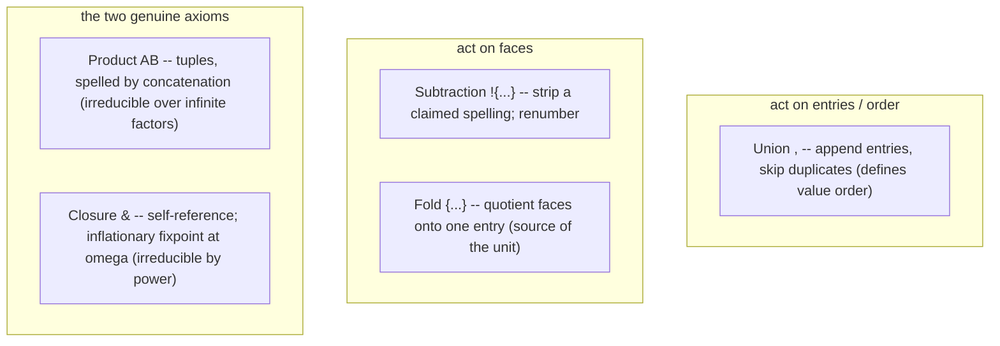

# Lesson 2: The five constructors

In lesson 1 we met the object: a universe, a pointed dictionary of entries and faces. This lesson is about the verbs -- the only five ways to *build* a universe. Every Hejmark expression you will ever see, no matter how baroque, is these five operations composed. There are not six and there are not four, and by the end of lesson 3 you will see that the count is forced, not chosen.

If you have read an older description of this language, you may remember a sixth constructor called "final segment," written `{a..}` for "every spelling from `a` onward." It is gone -- not merged into something else, *retired*. The spec no longer offers a way to write an open-ended range at all. Hold that thought; the closing section of this lesson explains where its job went.

## The one discipline: totality

Before the five, the rule they all share, because it is the soul of L1: **no constructor ever rejects.** Every one of them is a *total* function -- hand it any input, including nonsensical-looking boundary cases, and it returns a universe. A reversed range? Returns the empty universe. A fold over nothing? Returns the unit. A self-reference that builds nothing? Returns empty. The foundation document calls this "the floor's one manner." Contrast a parser, which spends half its code saying no. L1 never says no. Saying no is a job for the layer above (L1.5) and, more precisely, the layer above *that* (L2) -- and keeping it out of the floor is a deliberate design decision with a big payoff: because every expression denotes *something*, you never have to reason about "what if this is malformed." There is no malformed. There is only "what does this denote," and the answer always exists.

Keep totality in your pocket. Every time we hit a weird edge below, the question is never "is this allowed" (it is) but "what does totality force it to be."

## Constructor 1: Union `,`

`{a, b, c}` -- append entries. Union takes universes (or lone spellings, which are the singleton case) and lays their entries end to end, *in order*, **skipping any entry already present.**

Three properties, and the third is a surprise:

- **Idempotent** -- unioning something with itself adds nothing. `{a, a}` is just `{a}`. This is why the "skip if already present" clause matters.
- **Associative** -- grouping does not matter: `{a, {b, c}}` and `{{a, b}, c}` agree on which entries end up present.
- **Not commutative** -- order *does* matter, because union defines the entry order, and entry order is `value`, and `value` is the whole left coordinate of the capture. `{a, b}` and `{b, a}` have the same entries but `a` is entry $0$ in the first and entry $1$ in the second. In a world where position is data, reordering is not a no-op.

That last point is the tell that Hejmark is not doing set theory. Sets do not care about order. Universes do, because the finger's position is meaningful.

## Constructor 2: Subtraction `!{...}`

`{a..z, !{a,e,i,o,u}}` -- the 21 consonants. Subtraction removes spellings and then *renumbers*.

The subtle part is that subtraction acts on **spellings**, not entries directly. For each spelling in the operand, it strips the one face that claims that spelling. An entry that loses *all* its faces disappears (it has nothing left to be read as). A spelling that names nothing removes nothing -- that is the no-op boundary case that totality demands.

This gives subtraction two very different-looking behaviors that are secretly the same operation:

- On single-faced entries it looks like ordinary *entry removal*. `{a..z, !{a,e,i,o,u}}` drops five entries because each vowel was a single-faced entry and losing its one face killed it.
- On a folded, multi-faced entry it is a *face cut*. `{{cat,feline}, !{feline}}` is one entry that could be written `cat` or `feline`; subtract `feline` and you have one entry that survives, now spelled only `cat`. The entry did not die -- it lost a mask.

So subtraction is the constructor that reaches the *face* axis directly. And because it renumbers afterward -- surviving entries recompact their `value`s, surviving faces recompact their `face` indices -- the invariant "canonical means index 0" is preserved: after a cut, whatever face is now first *becomes* the canonical one.

Union and subtraction are duals in a precise way tied to the collision rule: union settles a contested spelling by dropping it from the *later* claimant; subtraction removes a *named* spelling from *its* claimant. Both act on spellings; entries come and go only as their faces do. Hold that symmetry loosely for now -- lesson 3 makes it exact.

## Constructor 3: Fold `{...}` (as a member)

Fold is the constructor that *creates* multi-faced entries -- it is where "one concept, many spellings" is born. `{a, {b, {c, C}}}` folds several faces onto one entry. Two behaviors define it:

- **Depth flattens.** `{a,{b,{c,C}}}` equals `{a,{b,c,C}}`. Nested folds collapse; a fold is a fold no matter how you parenthesize the faces inside it. A nested empty `{}` flattens down to the unit's one face -- the empty spelling -- which is exactly what gives `{{{},0}}` its two faces: the empty spelling `` (from the inner `{}`) and `0`. That little `{{{},0}}` is worth memorizing as "the fill factor": one entry you can write either as nothing or as `0`.
- **Total, via the unit.** Fold over a *denotationally empty* universe yields the **unit** (`{{}}`), not the empty universe. This is fold's boundary case and it is why the unit exists at all. `{{}}` is the canonical way to hit it, but `{{z..a}}` (a fold over a reversed, hence empty, range) and `{{a,!{a}}}` (a fold over `a`-minus-`a`, also empty) are *also* the unit -- because totality reads the operand's *denotation*, not the marks on the page. Two expressions that look different but denote the same empty universe both fold to the same unit.

The mental model: fold is "collapse these faces onto a single row." If there are no faces to collapse, you still get a row (totality) -- a row with a blank spine (the unit).

## Constructor 4: Product `{cat}{dog}`

Juxtaposition is multiplication. `{cat}{dog}` -- write two universes next to each other and you get a universe whose entries are **tuples**, one component drawn from each factor, spelled by concatenating the components, and ordered by *positional value* (lesson 3's mixed-radix story -- think "reading the tuple like a multi-digit number").

Properties:

- **Total** -- an empty factor gives the empty universe (multiply by zero, get zero).
- **The unit is the identity.** `{{}}A` equals `A`: the unit is one entry of zero width, so it contributes no characters and does not change entry order. This is exactly why the unit had to be "one entry" and not "no entries" -- an identity for multiplication must be a $1$, not a $0$. It also makes powers well-formed all the way down: `A^0` is the unit, just as $x^0 = 1$ -- which is exactly what L1.5's exponent notation (lesson 4) leans on.
- **Finite factors flatten; infinite factors do not.** `{cat}{dog}` collapses to `{catdog}` because both factors are finite -- that is compression, a mere adjacency. But an infinite factor cannot be flattened into a single spelling interval. *That* is why product is a genuine constructor and not just notation: over an infinite factor it does something no combination of the others can.

The parable: product is the Cartesian product of two dictionaries, with tuples spelled by gluing their parts together. `{a,ab}{b,c}` gives you the four tuples `(a,b), (a,c), (ab,b), (ab,c)`, spelled `ab, ac, abb, abc`. Their positional values are $0, 1, 2, 3$ -- the tuple read as a two-digit number, most-significant factor on the left.

## Constructor 5: Closure `&`

The fifth is the deep one, the one that makes Hejmark more than a calculator. `&` is the **self-reference token.** It is legal anywhere a member or a factor can stand, and it means "the thing I am currently inside of, one stage ago."

Precisely: `&` binds to the innermost enclosing brace expression (with one exception below), and that expression denotes the **closure at $\omega$** of its body. "Closure at $\omega$" is an inflationary process -- a fixpoint built in stages:

- Stage $X_0$ is the empty universe.
- Stage $X_{k+1}$ is $X_k$ unioned with the body, where every `&` inside the body is read as "$X_k$" (the previous stage).
- Entries are ordered by *first appearance*: everything new at stage 1, then everything new at stage 2, and so on -- "stage-major, body order within a stage."

The single exception to binding: a subtraction operand's braces (`!{...}`) are the subtraction's own, so an `&` inside a subtraction does *not* treat those braces as its binder; it looks further out.

Read the definition slowly against an example. `{a, &{b}}`:

- $X_0$ = empty.
- $X_1$ = empty union `{a, (empty){b}}` = `{a}` (the `&` was $X_0$ = empty, and empty times `{b}` is empty). So stage 1 gives `a`.
- $X_2$ = `{a, {a}{b}}` = `{a, ab}`. Now `&` is $X_1$ = `{a}`, times `{b}` is `ab`.
- $X_3$ adds `abb`. And so on: `a, ab, abb, abbb, ...`, order type $\omega$.

The key intuitions to carry:

- **Closure is the union rule read at $\omega$.** Accumulation *never retracts* -- each stage only adds. That monotonicity is exactly why every body denotes *something*: an ever-growing union always has a limit. Totality again, now at infinity.
- **A binder's braces are the closure's, not a fold's.** When you *use* a closure expression as a member, it *splices* its entries into the surrounding union (because closure is the union rule, and union appends entry-wise). If you actually want to *fold* a closure into a single multi-faced entry, you brace it one more time.
- **The boundary cases all still denote**, by totality:
  - A subtracted `&` cannot oscillate: `{{a,b,&{a,b}},!{&}}` puts everything at stage 1 and every later body is empty, so no flapping back and forth. Denotes `a, b, aa, ab, ...`.
  - A bare `&` is the union no-op: `{a, &}` is `{a}`, and `{&}` is empty. Self-union adds nothing, exactly as union always skips what is already present.
  - An "unguarded fill" still converges because collision cleans up after it: `{a, {{{},0}}&}` denotes `a, 0a, 00a, ...` -- each pass re-spells, and the collision rule strips the re-spelled face, leaving one genuinely new face per stage.
- **One limit, and no continuation past it.** A body still producing new entries at stage $\omega$ is *cut* there -- L1 goes up to the first limit and stops.

Closure is what lets Hejmark express things no regular expression can. The example `{ab, {a}&{b}}` denotes $a^n b^n$ -- $n$ copies of `a` followed by $n$ copies of `b`, for every $n$ -- which is the textbook example of a language *no* finite-state machine can recognize. That expression is the reason closure has to be a real axiom and cannot be compressed away: lesson 3 makes that a theorem.

## Where did the sixth constructor go?

An earlier version of this language had a sixth axiom: "final segment," written `{a..}`, meaning "every spelling from `a` onward, in shortlex order, forever." It has been retired outright. `docs/foundation/L1.md`'s notation table now has exactly one range form, and it is always **bounded**: `{x..y}` expands, at expansion time, into the finite union of the spellings from `x` through `y` listed in shortlex order. There is no open-ended `{x..}` any more.

Why is this safe, and why remove it rather than just keep calling it sugar? Two reasons, and they were always true, which is exactly why the constructor could be dropped without losing any expressive power:

- **An endpoint has to be an attained spelling**, the shortlex-least or shortlex-greatest of a closure-*free* (hence finite) universe. An unbounded operand has no greatest element to close the interval with, so "final segment" was never really a special case of *range* -- it was a different thing wearing range-shaped notation.
- **Everything final segment could denote, the closure already denotes**, written directly. The closure of the unit under the code-point set, `{{{}}, &C}`, generates *every spelling in shortlex order* -- that is this lesson's `{a, &{b}}` construction, run over the full alphabet instead of `{a,b}`. A tail starting partway through is that same closure with a bounded prefix subtracted off (a range, subtraction -- two constructors you already have). So "I want everything from here on" is spelled with closure and subtraction, not with a sixth axiom pretending to be a bounded range.

The practical upshot, which lesson 4 (surface syntax) will make concrete: when you need an unbounded universe, you reach for `&` directly -- often through the standard library's `str` (`{{{}},&@char}`, lesson 6) rather than typing the closure out by hand. Nothing is lost; one fewer thing sits on the axiom list.

## The map of the five

The grouping is a teaching aid, not a formal taxonomy -- subtraction reaches both entries and faces. But it captures the felt shape: union mostly shapes *which entries and in what order*; subtraction and fold mostly shape *how an entry is written*; product and closure are the ones that genuinely add power and therefore survive as axioms when everything else -- including, now, final segment -- gets demoted to compression.

## What you should now be able to say

- Every constructor is *total*: it always returns a universe, and boundary cases return the empty universe or the unit rather than an error.
- Union appends entries and defines their order (so it is not commutative); subtraction strips claimed spellings and renumbers; fold quotients faces onto one entry (and its empty case *is* the unit); product makes concatenated tuples; closure is self-reference resolved as an $\omega$-stage inflationary fixpoint.
- The two that cannot be reduced away -- product (over infinite factors) and closure (by expressive power) -- are the real axioms; the rest of the surface, including every range, is compression.
- There is no open-ended range notation any more: a bounded `{x..y}` lists a finite shortlex interval, and an unbounded "everything from here" is the closure, written directly.

Next: the theorems these five force -- positional value, canonical numerals, the reach of the ordinals, fixpoints, and the precise sense in which ranges and adjacency are "free."
