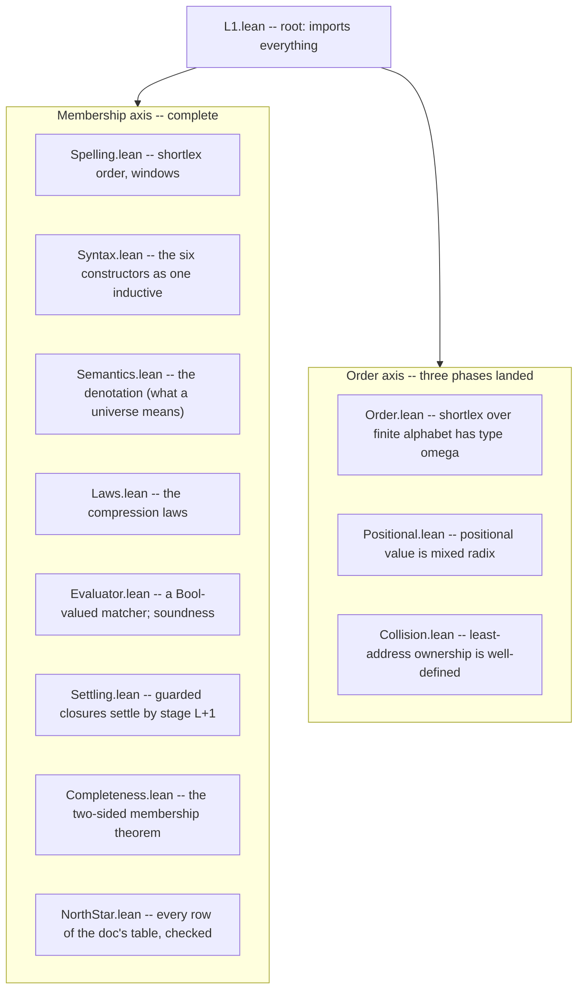

# Lesson 5: Reading the mechanization

You now know the math (lessons 1-3) and can read Lean (lesson 4). This lesson is the map of `static/lean/L1/` -- what each file proves, how they stack, and the one organizing distinction that makes the whole tree comprehensible: the split between the *membership axis* and the *order axis*.

## How to build it and check it yourself

From the repository root:

```sh
cd static/lean && lake build
```

That compiles every module through Lean's kernel. If it succeeds, every proof in the tree is verified. The Python CI gate wraps this so it runs under the normal test suite:

```sh
uv run pytest -k lean        # just the three Lean gate tests
```

Those three gates (all in `tests/infrastructure/test_lean.py`) are:

1. `test_lean_proofs_build` -- `lake build` exits clean.
2. `test_lean_headline_theorems_are_honestly_axiom_free` -- every theorem in the `HEADLINE_THEOREMS` tuple has an axiom footprint within `{propext, Classical.choice, Quot.sound}` (lesson 4's honesty check).
3. `test_lean_proofs_are_complete` -- no `.lean` file contains the tokens `sorry` or `axiom`.

If the Lean toolchain is not installed the build gate fails *loudly* rather than skipping silently -- you must set `HIMARK_SKIP_LEAN=1` to opt out on purpose. The design principle, straight from the Zen file in this repo: errors should never pass silently.

## The one distinction: two axes

A universe is a pointed dictionary, and the pointer has two coordinates (lesson 1): *which entry* (`value`) and *which face* (`face`). Correspondingly there are two different questions you can ask about a universe, and they turn out to have very different proof difficulty:

- The **membership axis** -- *which spellings does this universe wear?* This is pure structural set algebra. Collision moves *ownership* of a spelling from one entry to another, but it never changes *whether the spelling is worn at all*. So for membership you can ignore ordinals entirely and reason with ordinary induction over the constructors. This axis is mechanized **completely**.
- The **order axis** -- *in what order, and of what ordinal order type?* This is where the ordinals, the mixed-radix positional value, the collision addressing, and the transfinite ceiling live. It is much harder, and it is mechanized in **pieces**, three so far, with the full climb to $\varepsilon_0$ still open.

Every file in the tree belongs to one axis or the other, and knowing which tells you immediately what kind of reasoning to expect.



## The membership-axis files, in dependency order

Read this as a story: each file builds on the ones above it.

- **`Spelling.lean`** -- the foundation of the foundation: spellings are `List Nat` (a code point is just a `Nat`), and the file defines *shortlex* (`shortlexLt`: shorter first, ties by dictionary order) plus half-open *windows* used to model ranges and final segments. Its headline `singleton_shortlexLt_iff` says `[a] < [b]` in shortlex exactly when `a < b` as numbers. Note the honest caveat in its header: because code points are *all* of `Nat` (an infinite alphabet) rather than a finite set, the shortlex here is a total order but *not* yet of order type $\omega$ -- that type-$\omega$ claim needs a genuinely finite alphabet and is precisely what the order axis's `Order.lean` supplies separately. This is the file the user often has open, and it is the gentlest place to start reading actual proofs (its `lexLt_trans`, `shortlex_total` are clean induction-and-`omega` proofs).
- **`Syntax.lean`** -- the six constructors encoded as one *mutual inductive* type (`Member`/`Node`/`Factors`), with helpers for concatenation (`napp`), binder detection (`bindsb`), and the top-level shape predicates. This is the abstract syntax tree of L1.
- **`Semantics.lean`** -- the *denotation*: a `Prop`-valued definition (`walk`/`spells`/`fsplit`/`stage`, then `denotes`) that says what it means for a universe to wear a spelling. Because closure recurses through stages, this block is compiled by *well-founded* recursion (lesson 4), so it unfolds through generated equation lemmas rather than by raw `rfl`. Also here: the monotonicity and stage-accumulation lemmas ("more stages never lose a spelling").
- **`Laws.lean`** -- the *compression laws* from lesson 3, mechanized: union idempotence and commutativity, difference, intersection, range compression, adjacency, fold flattening, product unit and exponent-zero, the bare-`&` no-ops. The crown here is `unitClosure_generates`: the closure of the unit under a literal code-point range wears *exactly* the spellings over that range, proved two-sided. That is lesson 3's "the spelling order is generated, not postulated," made a theorem.
- **`Evaluator.lean`** -- a *Bool*-valued executable matcher (`containsb` and friends) mirroring the `Prop`-valued semantics, plus its soundness theorem `containsb_sound`: if the evaluator says yes, the denotation agrees. Bool-valued means it *computes* -- you can actually run it on an example, which `NorthStar.lean` does.
- **`Settling.lean`** -- lesson 3's fixpoint theorem, the hard one. Headline `guarded_settles`: on a guarded body, if a spelling ever appears at *some* stage it appears by stage `length s + 1`. The proof has three layers -- *amp-irrelevance* (a non-binder ignores the ambient closure), *locality* (a guarded body reads its recursion only at strictly shorter spellings, because the guard eats a character), and *stabilization* (strong induction on spelling length: past stage `|s|+1` the answer stops moving). This is the deepest proof in the tree; do not start here.
- **`Completeness.lean`** -- the converse of soundness, and the crown two-sided theorem `containsb_exact`: on a well-behaved fragment, the evaluator says yes *if and only if* the denotation holds. This is what certifies the matcher is *correct*, not just sound. Closures cross the Bool/Prop boundary here via the settling bound from `Settling.lean`.
- **`NorthStar.lean`** -- every row of `docs/foundation/L1.md`'s north-star table, verified. Positive membership samples compute through the evaluator (via `native_decide`, the compiled-computation tactic -- which is why these rows sit *outside* the axiom-honesty gate, per lesson 4); non-membership and emptiness rows are proved at the `Prop` level. This file is the payoff: the table you were told is "ground truth" in lesson 1 is machine-checked, row by row.

## The order-axis files (lesson 6 reads these line by line)

These three are the newest, the most self-contained (each is independent of the membership axis and of each other, except `Positional` building on `Order`), and therefore the *best first proofs to actually understand*.

- **`Order.lean`** -- phase A. Shortlex over a genuinely *finite* alphabet `Fin (m+1)` is a well-order of order type $\omega$. It builds an explicit order isomorphism (`value`, reading a spelling as a length-offset plus a base-`(m+1)` numeral) onto `(Nat, <)`, then invokes "$\omega$ is the type of Nat." Headline `finShortlex_type_omega0`. This is lesson 3's "finite alphabet gives type $\omega$," and it is the piece `Spelling.lean` explicitly deferred.
- **`Positional.lean`** -- phase B. Positional value is *mixed radix* over a product of finite factors (lesson 3's odometer/clock). It generalizes phase A's uniform base to a per-factor radix list `bs`, defines the mixed-radix reading by Horner recursion, and proves it is an order isomorphism onto `Fin (bs.prod)`. Headline `positional_value_type`: the product's order type is exactly the natural `bs.prod` -- "finite factors give naturals, and the order of multiplication is invisible." A bridge lemma `lexIndex_eq_mixedRadix` shows phase A is the constant-radix special case.
- **`Collision.lean`** -- phase C. The `<value, face>` address is an ordinal paired with a natural under lexicographic order; because that order is a *well-order*, every spelling has a *unique* least claimant. Headline `collision_settled`. This is lesson 3's collision rule -- "least address wins, later claimants drop" -- made a well-definedness theorem, with three tiny facts checking the doc's three documented collisions.

## What is proven, what is deferred, and why

Be honest about the boundary, because the README is:

- **Fully mechanized:** the entire membership axis, and three separable pieces of the order axis (type-$\omega$ for finite alphabets, mixed-radix positional value over finite factors, collision-ownership well-definedness).
- **Deferred:** entry order and first-appearance *enumeration* (`Universe.entries`), and the full *bounded transfinitude* climb to $\varepsilon_0$ (lesson 3's theorem 2). The last one is genuinely research-grade: it requires modeling closure stages, the nonlinear stage-type squaring, Cantor normal form, and the $\varepsilon_0$ bound. Lesson 3 told you *why* it is hard; the mechanization tree agrees by leaving it open.

Two documented *approximations* in the evaluator are worth knowing so you are not surprised (both are spelled out in the README's "two documented approximations" section):

- **Unsettled closures:** the executable matcher under-approximates on bodies that are not guarded -- it answers "no" at the stage bound where the true denotation might still say "yes." Exactness is proved precisely on the *settled* fragment (`guarded_settles`), which is the fragment L1.5's matcher restricts itself to anyway.
- **The fold unit:** denotational emptiness of a fold body is not Bool-decidable in general (with subtraction it becomes a language-difference emptiness problem), so the evaluator uses a *sound surrogate* ("no adding member"). One case diverges -- `{{a,!{a}}}` is the unit in the spec but the evaluator misses its empty face -- and no north-star row is affected.

These are not bugs; they are the exact, documented places where a *computable* checker cannot match an *ideal* denotation, and each one is fenced off by a theorem that says where the checker *is* exact.

## What you should now be able to say

- The tree splits into the *membership axis* (which spellings, pure set algebra, fully proved) and the *order axis* (what order type, ordinals, proved in three pieces).
- The membership files stack `Spelling -> Syntax -> Semantics -> {Laws, Evaluator} -> Settling -> Completeness -> NorthStar`, ending in a machine-checked reproduction of the doc's ground-truth table.
- The order-axis trio (`Order`, `Positional`, `Collision`) is self-contained and the best place to read real proofs -- which is exactly what lesson 6 does.
- The honesty gates check the build, the axiom footprint, and the absence of `sorry`/`axiom`; two evaluator approximations are documented and theorem-fenced; the $\varepsilon_0$ climb is deliberately deferred as research-grade.

Next: we read the three order-axis files closely -- the numbering function, the mixed-radix isomorphism, and the well-order behind collision ownership.
