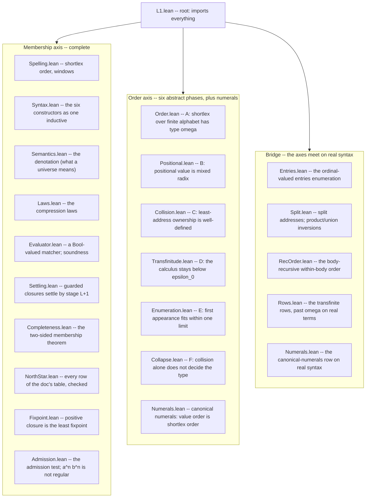

# Lesson 5: Reading the mechanization

You now know the math (lessons 1-3) and can read Lean (lesson 4). This lesson is the map of `static/lean/L1/` -- what each file proves, how they stack, and the one organizing distinction that makes the whole tree comprehensible: the split between the *membership axis* and the *order axis*.

## How to build it and check it yourself

From the repository root:

```sh
cd static/lean && lake build
```

That compiles every module through Lean's kernel. If it succeeds, every proof in the tree is verified. The Python CI gate wraps this so it runs under the normal test suite:

```sh
uv run pytest -k lean        # just the three Lean gate tests
```

Those three gates (all in `tests/infrastructure/test_lean.py`) are:

1. `test_lean_proofs_build` -- `lake build` exits clean.
1. `test_lean_headline_theorems_are_honestly_axiom_free` -- every theorem in the `HEADLINE_THEOREMS` tuple has an axiom footprint within `{propext, Classical.choice, Quot.sound}` (lesson 4's honesty check).
1. `test_lean_proofs_are_complete` -- no `.lean` file contains the tokens `sorry` or `axiom`.

If the Lean toolchain is not installed the build gate fails *loudly* rather than skipping silently -- you must set `HIMARK_SKIP_LEAN=1` to opt out on purpose. The design principle, straight from the Zen file in this repo: errors should never pass silently.

## The one distinction: two axes

A universe is a pointed dictionary, and the pointer has two coordinates (lesson 1): *which entry* (`value`) and *which face* (`face`). Correspondingly there are two different questions you can ask about a universe, and they turn out to have very different proof difficulty:

- The **membership axis** -- *which spellings does this universe wear?* This is pure structural set algebra. Collision moves *ownership* of a spelling from one entry to another, but it never changes *whether the spelling is worn at all*. So for membership you can ignore ordinals entirely and reason with ordinary induction over the constructors. This axis is mechanized **completely**.
- The **order axis** -- *in what order, and of what ordinal order type?* This is where the ordinals, the mixed-radix positional value, the collision addressing, and the transfinite ceiling live. It is much harder, and it is mechanized as **six self-contained abstract phases** (A through F), each capturing one doc claim over an explicit model rather than the real syntax.

Every file belongs to one axis or the other -- except the third directory, `L1/Bridge/`, which is the one place the axes meet: it instantiates the abstract phases against the real `Syntax.lean` terms, all the way up to the transfinite rows. Knowing which axis a file is on tells you immediately what kind of reasoning to expect.



## The membership-axis files, in dependency order

Read this as a story: each file builds on the ones above it.

- **`Spelling.lean`** -- the foundation of the foundation: spellings are `List Nat` (a code point is just a `Nat`), and the file defines *shortlex* (`shortlexLt`: shorter first, ties by dictionary order) plus half-open *windows* used to model ranges and final segments. Its headline `singleton_shortlexLt_iff` says `[a] < [b]` in shortlex exactly when `a < b` as numbers. Note the honest caveat in its header: because code points are *all* of `Nat` (an infinite alphabet) rather than a finite set, the shortlex here is a total order but *not* yet of order type $\omega$ -- that type-$\omega$ claim needs a genuinely finite alphabet and is precisely what the order axis's `Order.lean` supplies separately. This is the file the user often has open, and it is the gentlest place to start reading actual proofs (its `lexLt_trans`, `shortlex_total` are clean induction-and-`omega` proofs).
- **`Syntax.lean`** -- the six constructors encoded as one *mutual inductive* type (`Member`/`Node`/`Factors`), with helpers for concatenation (`napp`), binder detection (`bindsb`), and the top-level shape predicates. This is the abstract syntax tree of L1.
- **`Semantics.lean`** -- the *denotation*: a `Prop`-valued definition (`walk`/`spells`/`fsplit`/`stage`, then `denotes`) that says what it means for a universe to wear a spelling. Because closure recurses through stages, this block is compiled by *well-founded* recursion (lesson 4), so it unfolds through generated equation lemmas rather than by raw `rfl`. Also here: the monotonicity and stage-accumulation lemmas ("more stages never lose a spelling").
- **`Laws.lean`** -- the *compression laws* from lesson 3, mechanized: union idempotence and commutativity, difference, intersection, range compression, adjacency, fold flattening, product unit and exponent-zero, the bare-`&` no-ops. The crown here is `unitClosure_generates`: the closure of the unit under a literal code-point range wears *exactly* the spellings over that range, proved two-sided. That is lesson 3's "the spelling order is generated, not postulated," made a theorem.
- **`Evaluator.lean`** -- a *Bool*-valued executable matcher (`containsb` and friends) mirroring the `Prop`-valued semantics, plus its soundness theorem `containsb_sound`: if the evaluator says yes, the denotation agrees. Bool-valued means it *computes* -- you can actually run it on an example, which `NorthStar.lean` does.
- **`Settling.lean`** -- lesson 3's fixpoint theorem, the hard one. Headline `guarded_settles`: on a guarded body, if a spelling ever appears at *some* stage it appears by stage `length s + 1`. The proof has three layers -- *amp-irrelevance* (a non-binder ignores the ambient closure), *locality* (a guarded body reads its recursion only at strictly shorter spellings, because the guard eats a character), and *stabilization* (strong induction on spelling length: past stage `|s|+1` the answer stops moving). This is the deepest proof in the tree; do not start here.
- **`Completeness.lean`** -- the converse of soundness, and the crown two-sided theorem `containsb_exact`: on a well-behaved fragment, the evaluator says yes *if and only if* the denotation holds. This is what certifies the matcher is *correct*, not just sound. Closures cross the Bool/Prop boundary here via the settling bound from `Settling.lean`.
- **`NorthStar.lean`** -- every row of `docs/foundation/L1.md`'s north-star table, verified. Positive membership samples compute through the evaluator (via `native_decide`, the compiled-computation tactic -- which is why these rows sit *outside* the axiom-honesty gate, per lesson 4); non-membership and emptiness rows are proved at the `Prop` level. This file is the payoff: the table you were told is "ground truth" in lesson 1 is machine-checked, row by row. It also carries `anbn_exact`, the two-sided characterization of the `{ab, {a}&{b}}` row's language as *exactly* $a^n b^n$, which `Admission.lean` reuses.
- **`Fixpoint.lean`** -- the *positive* half of lesson 3's fixpoint theorem, on the real semantics. A positive walk (no subtraction operand enclosing the ambient `&`) is monotone and continuous in its amp, so the closure at $\omega$ is a genuine *least* fixpoint: `positive_fixpoint` (one more application of the body adds nothing) and `positive_least` (any prefixpoint contains the closure). The guarded half lives in `Settling.lean`; together they mechanize both halves of the doc's "Fixpoint on settled bodies."
- **`Admission.lean`** -- lesson 3's admission test, on the real semantics. `operand_needs_infinitely_many_removals` makes the universe operand axiomatic (finitely many entry-wise steps cannot carve the seam-free set out of `{a..}`), and `closure_admission` proves the $a^n b^n$ face set is not a regular language (Myhill-Nerode), so no closure-free arrangement reaches it and closure keeps its place as an axiom.

## The order-axis files: six phases, plus numerals

Each phase is self-contained (independent of the membership axis, and mostly of each other), which makes the first three the *best first proofs to actually understand* -- lesson 6 reads them line by line.

- **`Order.lean`** -- phase A. Shortlex over a genuinely *finite* alphabet `Fin (m+1)` is a well-order of order type $\omega$. It builds an explicit order isomorphism (`value`, reading a spelling as a length-offset plus a base-`(m+1)` numeral) onto `(Nat, <)`, then invokes "$\omega$ is the type of Nat." Headline `finShortlex_type_omega0`. This is lesson 3's "finite alphabet gives type $\omega$," and it is the piece `Spelling.lean` explicitly deferred.
- **`Positional.lean`** -- phase B. Positional value is *mixed radix* over a product of finite factors (lesson 3's odometer/clock). It generalizes phase A's uniform base to a per-factor radix list `bs`, defines the mixed-radix reading by Horner recursion, and proves it is an order isomorphism onto `Fin (bs.prod)`. Headline `positional_value_type`: the product's order type is exactly the natural `bs.prod` -- "finite factors give naturals, and the order of multiplication is invisible." A bridge lemma `lexIndex_eq_mixedRadix` shows phase A is the constant-radix special case.
- **`Collision.lean`** -- phase C. The `<value, face>` address is an ordinal paired with a natural under lexicographic order; because that order is a *well-order*, every spelling has a *unique* least claimant. Headline `collision_settled`. This is lesson 3's collision rule -- "least address wins, later claimants drop" -- made a well-definedness theorem, with three tiny facts checking the doc's three documented collisions.
- **`Transfinitude.lean`** -- phase D, bounded transfinitude: the ordinal ceiling from lesson 3's theorem 2, over an abstract ordinal calculus. The closure-free floor stays below $\omega^\omega$; linear closure caps at $u \cdot \omega$; nonlinear closure's squared stages sup to *exactly* $\omega^\omega$ (`nonlinear_closure_sup` -- the binary-trees showpiece); and the full calculus never reaches $\varepsilon_0$ (headline `l1Type_lt_epsilon0`, because $\varepsilon_0$ is closed under everything the calculus can do below it). Also carries the two product rows ($\omega \cdot 2$ and $\omega^2$) and the load-bearing left-collapse $n \cdot \omega = \omega$.
- **`Enumeration.lean`** -- phase E, first-appearance enumeration: stage-major order over $\omega$-many finite stages has type at most $\omega$ -- one limit, no continuation past it (headline `stageMajor_type_le_omega0`, exactly $\omega$ when new entries appear cofinally). The engine is a general fact worth knowing: a well order in which every element has finitely many predecessors has type at most $\omega$.
- **`Collapse.lean`** -- phase F, lesson 3's "collision alone does not decide the type," both halves: the `{a..}{a..}` survivors collapse to $\omega \cdot (m+1)$ (`cofinite_collision_collapses`) while the seam row's survivors keep $\omega \cdot \omega$ (`seam_collision_survives`) -- same collision rule, opposite effect on the type.
- **`Numerals.lean`** -- past the six lettered phases, the abstract half of the canonical-numerals theorem. On the leading-zero-free numerals of a sub-range head radix, the bare positional value `lexIndex` -- phase A's numeral *without* the length offset -- is already the shortlex order (`numeral_fshortlex_iff_lexIndex_lt`), because no leading zero makes the wider numeral the larger value and phase A's within-width tie-break handles the rest. Its enumeration (`numeralValueIso`, needing a genuine radix `0 < m`) pins the order type at exactly $\omega$ (`numeralShortlex_type_omega0`). This is the phase that says "value order and spelling order agree on the canonical numerals," which is the fact L1.5's value line (`where`) leans on; the real-syntax half is `Bridge/Numerals.lean` below.

## `L1/Bridge/`: where the axes meet

The abstract phases prove the doc's order claims over explicit models. `L1/Bridge/` ties them to the *real* syntax -- an ordinal-valued entries enumeration over actual `Syntax.lean` terms, which is the Lean shape of the Python `Universe.entries`.

- **`Entries.lean`** -- the enumeration itself: `Entries n` is the subtype of spellings a node denotes, and `entriesType` (its shortlex order type) is total on *every* term, because Mathlib's shortlex is a well order even over the infinite alphabet -- what needs finiteness is type $\omega$, not well-orderedness. Phase A and phase E are instantiated here against the real `stage` ladder, and on the demotion row `{{{}}, &C}` the generated first-appearance order provably *is* the spelling order -- the order-level half of `unitClosure_generates`.
- **`Split.lean`** -- the split address space: product and union term shapes with their denotation inversions, and phase C's collision theorem replayed with *real cuts* (`s = p ++ q`) as addresses (`prod2_collision_settled`: every denoted spelling of a product has a unique least split).
- **`RecOrder.lean`** -- the body-recursive within-body order, the deepest file on this axis: `entryRecLt` recurses into each constructor's own structure at every depth, is a well order on every subtraction-free node, restricts back to shortlex on a leaf, and carries the type laws (positional product, union sum with the skip rule priced in, closure at $\omega$). Its design history is recorded in `RecOrder.design.md` alongside it.
- **`Rows.lean`** -- the payoff: the transfinite rows on real terms, all through `entryRecType`. The union row at $\omega + 2$, the `{b,c}{a..}` row at $\omega \cdot 2$, the seam row at $\omega^2$ (marker outside the closure range, so every spelling splits uniquely), the total collapse back to $\omega$, and the doc-literal `{a..}{a..}` collapse at $\omega \cdot 4$ -- the doc's "$\omega \cdot k$, $k$ finite" with the recursive order's own $k$. It also carries the *in-range* seam row `inSeamRow_entryRecType`: the doc-faithful `{b}{a..}{b}{a..}` with the marker drawn from *inside* the closure range, where the splits genuinely collide (`inSeamRow_splits_collide`) yet the recursion's own least-split choice keeps the marker-free heads and $\omega^2$ survives -- phase F's abstract `seam_collision_survives`, now landed on a real term.
- **`Numerals.lean`** -- the real-syntax half of `Order/Numerals.lean`: the canonical-numerals north-star row `{0, {1..9, &{0..9}}}`. The term denotes exactly the canonical numerals (`numerals_generates`); first appearance under the closure is width, so the generated first-appearance order collapses onto the spelling order and both agree with the decimal value each entry spells (`numerals_body_entryLt_iff`, `numerals_entrySpellLt_iff_numVal_lt`) -- the doc's "first-appearance order is value order." All three enumerations sit at exactly $\omega$.

## What is proven, what is deferred, and why

Be honest about the boundary, because the README is:

- **Fully mechanized:** the entire membership axis (including the fixpoint theorem and the admission witness), all six abstract order phases -- including the $\varepsilon_0$ ceiling itself -- the canonical-numerals theorem on both the abstract and the real-syntax side, and the bridge onto real syntax up through the transfinite rows, including the *in-range* seam row where the splits genuinely collide (`inSeamRow_entryRecType` -- once deferred, now landed).
- **Deferred, permanently:** development is frozen here, and the README's "What this does not prove" section lists the *three* items that stay open. Each is a research increment, not a gap in what landed: the *n-ary* positional machinery (the product type laws are proved for the binary `prod2`; the rows only need the binary form), the *converse* half of the admission test (closure-free implies regular, which needs a DFA construction; the witness half that actually rules compression out *is* proved), and the ordinal-level *face axis* on real syntax.

Two documented *approximations* in the evaluator are worth knowing so you are not surprised (both are spelled out in the README's "two documented approximations" section):

- **Unsettled closures:** the executable matcher under-approximates on bodies that are not guarded -- it answers "no" at the stage bound where the true denotation might still say "yes." Exactness is proved precisely on the *settled* fragment (`guarded_settles`), which is the fragment L1.5's matcher restricts itself to anyway.
- **The fold unit:** denotational emptiness of a fold body is not Bool-decidable in general (with subtraction it becomes a language-difference emptiness problem), so the evaluator uses a *sound surrogate* ("no adding member"). One case diverges -- `{{a,!{a}}}` is the unit in the spec but the evaluator misses its empty face -- and no north-star row is affected.

These are not bugs; they are the exact, documented places where a *computable* checker cannot match an *ideal* denotation, and each one is fenced off by a theorem that says where the checker *is* exact.

## What you should now be able to say

- The tree splits into the *membership axis* (which spellings, pure set algebra, fully proved) and the *order axis* (what order type, ordinals, proved as six abstract phases), meeting on real syntax in `L1/Bridge/`.
- The membership files stack `Spelling -> Syntax -> Semantics -> {Laws, Evaluator} -> Settling -> Completeness -> NorthStar -> {Fixpoint, Admission}`, ending in a machine-checked reproduction of the doc's ground-truth table plus the fixpoint and admission theorems.
- The first order-axis trio (`Order`, `Positional`, `Collision`) is self-contained and the best place to read real proofs -- which is exactly what lesson 6 does; `Transfinitude`, `Enumeration`, and `Collapse` extend the same style up to the $\varepsilon_0$ ceiling, and `Bridge/` lands it all on real terms.
- The honesty gates check the build, the axiom footprint, and the absence of `sorry`/`axiom`; two evaluator approximations are documented and theorem-fenced; the three remaining items are deliberately deferred, listed in the README, and the development is frozen there.

Next: we read the first three order-axis files closely -- the numbering function, the mixed-radix isomorphism, and the well-order behind collision ownership.
