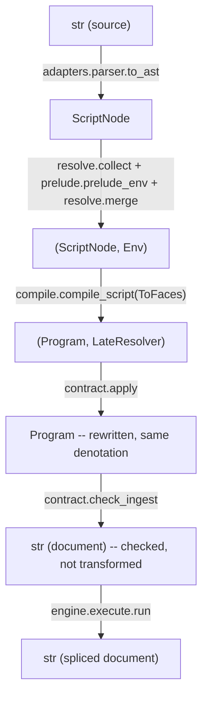

# Lesson 7: The pipeline

Tracks A's four lessons told you what a `.hmk` script *means*. This lesson is about what actually happens when you run `hejmark run script.hmk target.txt` -- the concrete stages source text passes through, in `hejmark/core/`, on the way to a rewritten document. `hejmark/core/README.md` is the terse version of this lesson; read that after this one, once the shape is familiar.

## The whole trip, stage by stage

The spine is `hejmark.run(source, text)` -- the one call that touches every stage below.

| # | Stage | File | Does |
| --- | --- | --- | --- |
| 0 | Entry | `hejmark/__init__.py` | Public API; binds the parser once, fetches std-lib text |
| 1 | Grammar | `static/grammar/*.g4` | Hand-edited ANTLR grammar |
| 2 | Codegen | `hejmark/adapters/antlr.py` | Shells out to `antlr4`; writes the gitignored `hejmark/adapters/_gen/` |
| 3 | Std-lib fetch | `hejmark/adapters/library.py` | Reads `static/std.hmk` (lesson 6's entries) once, cached |
| 4 | Parse -> AST | `hejmark/adapters/parser.py` + `build.py` | ANTLR's parse tree becomes a `ScriptNode` (`core/compiler/ast.py`). Last point any ANTLR type exists in the pipeline |
| 5 | Composition root | `core/driver.py` | Sequences everything below |
| 6 | Name environment | `core/compiler/{resolve,prelude,alphabet}.py` | Collect declarations, check acyclicity (lesson 4), seed `char`, merge in the std-lib -> `Env` |
| 7 | Lowering | `core/compiler/{compile,expand,valueline,late}.py` | Surface -> the floor's five constructors (`core/floor/syntax.py`); back-references go into a `SlotTable` instead -> `Program` + `LateResolver` |
| 8 | L2 contract | `core/contract.py` | `apply()` (the value-cut collapse, lesson 5, as a `Program -> Program` rewrite) + `check_ingest()` (the sentinel ingest refusal) |
| 9 | Engine | `core/engine/execute.py` + `engine/scan/{match,capture}.py` | Runs the program, denoting floor nodes via `core/engine/denote/universe.py` |
| 10 | Output | back through `driver.run()` | The spliced document string (or a `Match`/iterator, for `match`/`finditer`) |

Stages 0-4 turn a file into a faithful tree; stages 5-8 are entirely the compiler deciding what the script *means*; stage 9 is the only stage that ever runs against real text. That last split is the one to hold onto, because it is also where the codebase draws its hardest internal line.

## The types that actually cross each boundary

| Type | Defined in | Carries |
| --- | --- | --- |
| `ScriptNode` | `core/compiler/ast.py` | The faithful surface AST: lines, in source order, nothing resolved yet |
| `Env` | `core/compiler/resolve.py` | Name -> declaration bindings, `uni`/`def` merged with the prelude, already acyclicity-checked |
| `Program` | `core/ir/program.py` | The plain-data compiled script: statements, templates, and the faces to strip on exit. Fully serializable |
| `LateResolver` | `core/ir/program.py` | A back-reference slot's resolver -- kept out of `Program` on purpose, so the wire format stays pure data |
| `ToFaces` | `core/ir/program.py` | The other direction: a denotation's canonical faces, injected so expansion can read one without importing an engine |
| `Query` | `core/engine/scan/match.py` | One compiled+loaded query -- `parse`/`match`/`finditer`'s payload, the sibling of `Program` for a single expression |
| `Match` | `core/engine/scan/match.py` | One scan hit: span + captures |

Two payloads never mix. A `Program` (a whole script, for `run`) and a `Query` (one expression, for `parse`/`match`/`finditer`) come from different compiler functions (`compile_script` vs `compile_single`) and are consumed by different engine entry points. Notice, too, which stage `contract.py` sits at: `parse`/`match`/`finditer` stop after stage 7 and **skip `contract.py` entirely** -- there is no document to ingest-check and no program-level rewrite worth doing for a single expression. Only `run` (and `emit_program`, for handing a program to another engine) crosses the L2 seam.

## The independence contract: compiler and engine never import each other

This is the load-bearing architectural fact of the whole codebase, and it is enforced by tooling (`import-linter`, checked in CI), not just convention: **`core/compiler/` and `core/engine/` never import one another.** `core/driver.py` is the *only* module that sees both, and it wires them together through an `Adapters(to_ast, engine)` bundle -- the engine arrives as a *port* (a `Protocol` in `core/ir/ports.py`), never as a concrete class the compiler names directly.

Why go to this trouble? Because of this project's stated direction of travel: the engine is meant to eventually be replaced by an out-of-process implementation in another language entirely (lesson 8 is that story), with Python keeping only parsing and compiling. A hard import boundary today is what makes that swap possible tomorrow without a rewrite of everything around it.

But there is a wrinkle: two things genuinely *do* need to cross that boundary, in opposite directions, and pretending they did not would just move the coupling somewhere less visible.

- **`LateResolver`** -- a back-reference like `$k` (lesson 4) cannot be lowered into an ordinary floor node ahead of time, because it needs to know *what actually hit* before it can be expanded. So the compiler leaves it as a numbered *slot* instead, and hands the engine a callback: "once you have bound this factor, call me with the faces it hit, and I will hand you back the floor universe those faces expand to." The engine calls this at match time, one slot at a time, and re-enters the compiler's own expansion machinery to do it.
- **`ToFaces`** -- lesson 4's `@0` and value cuts are *defined* as a bounded read of a denotation (the zero entry; the digits of a radix), and reading a denotation is the engine's whole job, not the compiler's. So the compiler is handed a lazy callback -- `canonical_faces`, implemented by `denote/universe.py` -- that streams a universe's canonical faces on demand, and it calls that at *expansion* time, whenever a surface form needs to peek at what something denotes.

Both crossings are deliberately **callback values injected by `driver.py`, never imports.** The type of each callback is declared once, in `core/ir/program.py`, where both sides can see it without either side needing to see the other's implementation.

This was not assumed to be unavoidable -- it was checked. The grammar admits a back-reference read in exactly three syntactic positions (a query segment, a pipeline argument, a value bound), and only the segment position is content-independent; a value-bound read has to be parsed as a numeral in the head's own radix (lesson 4's numeral parameters), and a pipeline-argument read can land on an *exponent count*, which changes the very *shape* of the expanded node (how many factors a product has). Moving that logic into the engine would mean moving most of L1.5 there too, against the house rule that the engine stays "dumb about the language" -- it denotes and matches; it does not parse, resolve names, or expand surface syntax.

## Import layering, the short version

The rest of the layering (enforced the same way, by `import-linter` contracts in `pyproject.toml`) is a strict stack, each level exhaustive -- nothing skips a layer:

- `hejmark`: `cli -> adapters -> core`.
- `core`: `driver -> {compiler | engine | contract} -> ir -> floor`.
- `core/compiler`: `compile -> prelude -> ports -> late -> expand -> valueline -> alphabet -> resolve -> ast`.
- `core/engine`: `service -> execute -> scan -> denote -> budget`.
- `core/engine/denote`: `universe -> split -> window -> order`.

Two details worth carrying past this lesson: **denotation is engine-owned**, not shared -- `universe.py`/`split.py`/`window.py`/`order.py` live under `engine/denote/` precisely because denoting a floor tree is what it takes to *execute* it, while `core/floor/` stays data-only (the five constructors, where a closure binds, how long a face reaches -- lesson 5's reach rewrite). And **`budget.py` sits at the bottom of the engine stack** because L2's work meter (lesson 5) is charged at the one place every run funnels through -- the membership question, denotation's own chokepoint -- even though the runs that *open* a budget live further up, in `scan` and `execute`.

## The testing convention that keeps this honest

One repo-wide rule worth knowing before you touch any of this: every module under `hejmark/` that defines a top-level function or class needs a mirror test at the matching path under `tests/unit/` -- `tests/test_lint.py`'s `test_tests_mirror_package` fails the whole suite otherwise. That same file also runs `ruff`, `ty`, `import-linter`, `vulture`, and `ast-grep` as ordinary pytest tests, plus a 400-line cap on any authored module. None of this is about style for its own sake -- it is what makes the compiler/engine boundary in this lesson an enforced fact rather than a comment nobody re-checks.

## What you should now be able to say

- The pipeline is source -> AST -> name environment -> lowered `Program` (+ `LateResolver`) -> L2's rewrite and ingest check -> engine execution -> spliced document, and `run` is the only entry point that touches every stage.
- `parse`/`match`/`finditer` stop before `contract.py` -- there is no document and no whole-script rewrite for a single compiled expression.
- The compiler and the engine never import each other; `driver.py` is the one place that sees both, wiring them through an injected `Adapters` bundle.
- Two callbacks cross that boundary in opposite directions -- `LateResolver` (engine calls compiler, at match time, to expand a back-reference slot) and `ToFaces` (compiler calls engine, at expansion time, to read `@0` or a value cut's digits) -- and both were shown, not assumed, to be unavoidable.
- Denotation lives under `engine/denote/`, not in the shared `floor/`, because denoting a tree is what running it requires.

Next: what's on the other side of that engine boundary right now -- the wire protocol a whole other process can speak, and `rust/`, a second engine that has never seen a parser.
