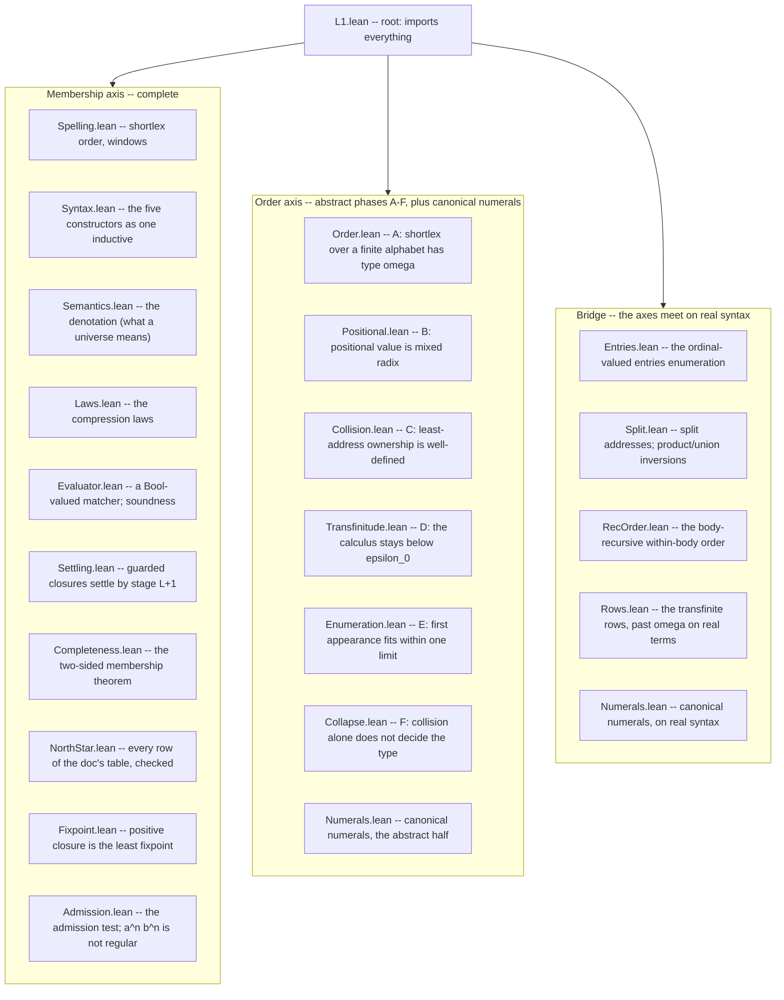

# Lesson 10: Reading the mechanization

You now know the math (Track A) and can read Lean (lesson 9). This lesson is the map of `static/lean/L1/` -- what each file proves, how they stack, and the one organizing distinction that makes the whole tree comprehensible: the split between the *membership axis* and the *order axis*.

## How to build it and check it yourself

From the repository root:

```sh
cd static/lean && lake build
```

That compiles every module through Lean's kernel. If it succeeds, every proof in the tree is verified. The Python CI gate wraps this so it runs under the normal test suite:

```sh
uv run pytest -k lean        # just the three Lean gate tests
```

Those three gates (all in `tests/infrastructure/test_lean.py`) are:

1. `test_lean_proofs_build` -- `lake build` exits clean.
2. `test_lean_headline_theorems_are_honestly_axiom_free` -- every theorem in the `HEADLINE_THEOREMS` tuple has an axiom footprint within `{propext, Classical.choice, Quot.sound}` (lesson 9's honesty check).
3. `test_lean_proofs_are_complete` -- no `.lean` file contains the tokens `sorry` or `axiom`.

If the Lean toolchain is not installed the build gate fails *loudly* rather than skipping silently -- you must set `HEJMARK_SKIP_LEAN=1` to opt out on purpose, the same "errors should never pass silently" discipline this whole project applies everywhere else.

## The one distinction: two axes

A universe is a pointed dictionary, and the pointer has two coordinates (lesson 1): *which entry* (`value`) and *which face* (`face`). Correspondingly there are two different questions you can ask about a universe, and they turn out to have very different proof difficulty:

- The **membership axis** -- *which spellings does this universe wear?* This is pure structural set algebra. Collision moves *ownership* of a spelling from one entry to another, but it never changes *whether the spelling is worn at all*. So for membership you can ignore ordinals entirely and reason with ordinary induction over the constructors. This axis is mechanized **completely**, against the real syntax and semantics.
- The **order axis** -- *in what order, and of what ordinal order type?* This is where the ordinals, the mixed-radix positional value, the collision addressing, the transfinite ceiling, and the canonical-numerals theorem live. It is much harder, and it is mechanized as a sequence of **self-contained abstract phases**, each capturing one doc claim over an explicit model rather than the real syntax.

Every file belongs to one axis or the other -- except the third directory, `L1/Bridge/`, which is the one place the axes meet: it instantiates the abstract phases against the real `Syntax.lean` terms, all the way up through the transfinite rows and the canonical-numerals north-star row.



## The membership-axis files, in dependency order

Read this as a story: each file builds on the ones above it.

- **`Spelling.lean`** -- the foundation of the foundation: spellings are `List Nat` (a code point is just a `Nat`), and the file defines *shortlex* (`shortlexLt`: shorter first, ties by dictionary order) plus half-open *windows* used to model ranges. Its headline `singleton_shortlexLt_iff` says `[a] < [b]` in shortlex exactly when `a < b` as numbers. Note the honest caveat in its header: because code points are *all* of `Nat` (an infinite alphabet) rather than a finite set, the shortlex here is a total order but *not* yet of order type $\omega$ -- that type-$\omega$ claim needs a genuinely finite alphabet and is precisely what the order axis's `Order.lean` supplies separately. This is the gentlest place to start reading actual proofs (its `lexLt_trans`, `shortlex_total` are clean induction-and-`omega` proofs).
- **`Syntax.lean`** -- the five constructors encoded as one *mutual inductive* type (`Member`/`Node`/`Factors`), with helpers for concatenation (`napp`), binder detection (`bindsb`), and the top-level shape predicates. This is the abstract syntax tree of L1.
- **`Semantics.lean`** -- the *denotation*: a `Prop`-valued definition (`walk`/`spells`/`fsplit`/`stage`, then `denotes`) that says what it means for a universe to wear a spelling. Because closure recurses through stages, this block is compiled by *well-founded* recursion (lesson 9), so it unfolds through generated equation lemmas rather than by raw `rfl`. Also here: the monotonicity and stage-accumulation lemmas ("more stages never lose a spelling").
- **`Laws.lean`** -- the *compression laws* from lesson 3, mechanized: union idempotence and commutativity, difference, intersection, range compression, adjacency, fold flattening, product unit and exponent-zero, the bare-`&` no-ops. The crown here is `unitClosure_generates`: the closure of the unit under a literal code-point range wears *exactly* the spellings over that range, proved two-sided -- lesson 2's "final segment retired, the closure generates it directly" claim, and lesson 3's "the spelling order is generated, not postulated," both made a theorem.
- **`Evaluator.lean`** -- a *Bool*-valued executable matcher (`containsb` and friends) mirroring the `Prop`-valued semantics, plus its soundness theorem `containsb_sound`: if the evaluator says yes, the denotation agrees. Bool-valued means it *computes* -- you can actually run it on an example, which `NorthStar.lean` does.
- **`Settling.lean`** -- lesson 3's fixpoint theorem, the hard one. Headline `guarded_settles`: on a guarded body, if a spelling ever appears at *some* stage it appears by stage `length s + 1`. The proof has three layers -- *amp-irrelevance* (a non-binder ignores the ambient closure), *locality* (a guarded body reads its recursion only at strictly shorter spellings, because the guard eats a character), and *stabilization* (strong induction on spelling length: past stage `|s|+1` the answer stops moving). This is the deepest proof in the tree; do not start here.
- **`Completeness.lean`** -- the converse of soundness, and the crown two-sided theorem `containsb_exact`: on a well-behaved fragment, the evaluator says yes *if and only if* the denotation holds. This is what certifies the matcher is *correct*, not just sound. Closures cross the Bool/Prop boundary here via the settling bound from `Settling.lean`.
- **`NorthStar.lean`** -- every row of `docs/foundation/L1.md`'s north-star table, verified. Positive membership samples compute through the evaluator (via `native_decide`, the compiled-computation tactic -- which is why these rows sit *outside* the axiom-honesty gate, per lesson 9); non-membership and emptiness rows are proved at the `Prop` level. This file is the payoff: the table you were told is "ground truth" in lesson 1 is machine-checked, row by row. It also carries `anbn_exact`, the two-sided characterization of the `{ab, {a}&{b}}` row's language as *exactly* $a^n b^n$, which `Admission.lean` reuses.
- **`Fixpoint.lean`** -- the *positive* half of lesson 3's fixpoint theorem, on the real semantics. A positive walk (no subtraction operand enclosing the ambient `&`) is monotone and continuous in its amp, so the closure at $\omega$ is a genuine *least* fixpoint: `positive_fixpoint` (one more application of the body adds nothing) and `positive_least` (any prefixpoint contains the closure). The guarded half lives in `Settling.lean`; together they mechanize both halves of the doc's "Fixpoint on settled bodies."
- **`Admission.lean`** -- lesson 3's admission test, on the real semantics. `operand_needs_infinitely_many_removals` makes the universe operand axiomatic (finitely many entry-wise steps cannot carve the seam-free set out of an unbounded closure), and `closure_admission` proves the $a^n b^n$ face set is not a regular language (Myhill-Nerode), so no closure-free arrangement reaches it and closure keeps its place as an axiom.

## The order-axis files: phases A through F, and beyond

Each lettered phase is self-contained (independent of the membership axis, and mostly of each other), which makes the first three the *best first proofs to actually understand* -- lesson 11 reads them line by line.

- **`Order.lean`** -- phase A. Shortlex over a genuinely *finite* alphabet `Fin (m+1)` is a well-order of order type $\omega$. Headline `finShortlex_type_omega0`. This is lesson 3's "finite alphabet gives type $\omega$," and it is the piece `Spelling.lean` explicitly deferred.
- **`Positional.lean`** -- phase B. Positional value is *mixed radix* over a product of finite factors (lesson 3's odometer/clock). Headline `positional_value_type`: the product's order type is exactly the natural `bs.prod` -- "finite factors give naturals, and the order of multiplication is invisible."
- **`Collision.lean`** -- phase C. The `<value, face>` address is an ordinal paired with a natural under lexicographic order; because that order is a *well-order*, every spelling has a *unique* least claimant. Headline `collision_settled`. This is lesson 3's collision rule, made a well-definedness theorem.
- **`Transfinitude.lean`** -- phase D, bounded transfinitude: the ordinal ceiling from lesson 3's theorem 3, over an abstract ordinal calculus. The closure-free floor stays below $\omega^\omega$; linear closure caps at $u \cdot \omega$; nonlinear closure's squared stages sup to *exactly* $\omega^\omega$; and the full calculus never reaches $\varepsilon_0$ (headline `l1Type_lt_epsilon0`).
- **`Enumeration.lean`** -- phase E, first-appearance enumeration: stage-major order over $\omega$-many finite stages has type at most $\omega$ -- one limit, no continuation past it (headline `stageMajor_type_le_omega0`, exactly $\omega$ when new entries appear cofinally).
- **`Collapse.lean`** -- phase F, lesson 3's "collision alone does not decide the type," both halves: a product-of-tails-style collapse to $\omega \cdot (m+1)$ (`cofinite_collision_collapses`) while the seam row's survivors keep $\omega \cdot \omega$ (`seam_collision_survives`) -- same collision rule, opposite effect on the type.
- **`Numerals.lean`** -- past the lettered phases, this proves lesson 3's *canonical-numerals* theorem's abstract half: on the leading-zero-free numerals of a sub-range head radix, the bare positional value `lexIndex` (no length offset) is already the shortlex order (`numeral_fshortlex_iff_lexIndex_lt`), and the enumeration pins the order type at exactly $\omega$ (`numeralShortlex_type_omega0`, needing a genuine radix -- at radix 1 the zero digit is the only canonical numeral).

## `L1/Bridge/`: where the axes meet

The abstract phases prove the doc's order claims over explicit models. `L1/Bridge/` ties them to the *real* syntax -- an ordinal-valued entries enumeration over actual `Syntax.lean` terms, which is the Lean shape of the Python `Universe.entries`.

- **`Entries.lean`** -- the enumeration itself: `Entries n` is the subtype of spellings a node denotes, and `entriesType` (its shortlex order type) is total on *every* term, because Mathlib's shortlex is a well order even over the infinite alphabet -- what needs finiteness is type $\omega$, not well-orderedness. Phase A and phase E are instantiated here against the real `stage` ladder, and on the demotion row `{{{}}, &C}` the generated first-appearance order provably *is* the spelling order -- the order-level half of `unitClosure_generates`.
- **`Split.lean`** -- the split address space: product and union term shapes with their denotation inversions, and phase C's collision theorem replayed with *real cuts* (`s = p ++ q`) as addresses (`prod2_collision_settled`: every denoted spelling of a product has a unique least split).
- **`RecOrder.lean`** -- the body-recursive within-body order, the deepest file on this axis: `entryRecLt` recurses into each constructor's own structure at every depth (union blocks disjoint, products mixed-radix over the recursion's own split choice, a binder node by its closure rank), is a well order on every subtraction-free node, and restricts back to shortlex on a leaf. It carries the type laws that drive `Rows.lean`: the positional product law, the union sum law (and its disjoint corollary), and the closure demotion at $\omega$. Its design history is recorded in `RecOrder.design.md` alongside it, if you want the story of how it got here.
- **`Rows.lean`** -- the payoff: the transfinite rows on real terms, all through `entryRecType`. The union row past the limit at $\omega + 2$, the `{b,c}{a..}`-shaped row at $\omega \cdot 2$, the seam row at $\omega^2$ (proved *twice* -- once with the colliding marker outside the closure's range, once genuinely inside it, where the recursion's own least-split choice is what keeps $\omega^2$ standing), the total collapse back to $\omega$, and the doc-literal nonempty-factor collapse at $\omega \cdot 4$ under this recursive order (a $k$-shift from the cruder spelling-order approximation's $\omega \cdot 2$ -- the doc's "collapses to $\omega \cdot k$, $k$ finite" stands either way, just with a different $k$).
- **`Numerals.lean`** -- the canonical-numerals north-star row `{0, {1..9, &{0..9}}}`, landed on real syntax: the closure generates exactly the nonzero-headed numerals, first appearance is width, the stage-major order collapses onto shortlex, and all of it agrees with the decimal value each entry spells -- lesson 3's "first-appearance order under the numerals closure is value order," now checked on the actual term rather than an abstract model.

## What is proven, what is deferred, and why

Be honest about the boundary, because the tree's own README is:

- **Fully mechanized:** the entire membership axis (including the fixpoint theorem and the admission witness), every order-axis phase -- including the $\varepsilon_0$ ceiling and canonical numerals -- and the bridge onto real syntax through the transfinite rows and the numerals row.
- **Deferred, permanently:** three items, each a research increment rather than a gap in what landed. The *n-ary* positional machinery (the product type laws are proved for the binary form; the real rows only ever need that binary form). The *converse* half of the admission test (closure-free implies regular, which would need a DFA construction; the witness half that actually rules compression out -- the direction that matters for keeping closure on the axiom list -- *is* proved). And the ordinal-level *face axis* on real syntax (rows like `{{{},0}}{0..9}` exercise a face axis distinct from the entry axis, and the north-star parse gate accepts them, but the ordinal-level face-vs-entry distinction itself is not mechanized over real terms).

Two documented *approximations* in the evaluator are worth knowing so you are not surprised:

- **Unsettled closures:** the executable matcher under-approximates on bodies that are not guarded -- it answers "no" at the stage bound where the true denotation might still say "yes," matching Python's `HimarkUnsettledError` refusal (lesson 5) rather than silently guessing. Exactness is proved precisely on the *settled* fragment (`guarded_settles`), which is the fragment L1.5's matcher restricts itself to anyway.
- **The fold unit:** denotational emptiness of a fold body is not Bool-decidable in general (with subtraction it becomes a language-difference emptiness problem), so the evaluator uses a *sound surrogate* ("no adding member"). One case diverges -- `{{a,!{a}}}` is the unit in the spec but the evaluator misses its empty face -- and no north-star row is affected.

These are not bugs; they are the exact, documented places where a *computable* checker cannot match an *ideal* denotation, and each one is fenced off by a theorem that says where the checker *is* exact.

## What you should now be able to say

- The tree splits into the *membership axis* (which spellings, pure set algebra, fully proved) and the *order axis* (what order type, ordinals, proved as a sequence of abstract phases), meeting on real syntax in `L1/Bridge/`.
- The membership files stack `Spelling -> Syntax -> Semantics -> {Laws, Evaluator} -> Settling -> Completeness -> NorthStar -> {Fixpoint, Admission}`, ending in a machine-checked reproduction of the doc's ground-truth table plus the fixpoint and admission theorems.
- The order axis runs phases A through F (shortlex-is-omega, mixed-radix, collision, the $\varepsilon_0$ ceiling, first-appearance enumeration, collision-doesn't-decide-the-type) plus a newer canonical-numerals phase; `Bridge/` lands every one of them on real terms, up through the transfinite rows and the numerals row.
- Three items stay permanently deferred by design (n-ary positional machinery, the admission test's converse, the ordinal-level face axis on real syntax); two evaluator approximations are documented and theorem-fenced rather than silently wrong.

Next: we read the first three order-axis files closely -- the numbering function, the mixed-radix isomorphism, and the well-order behind collision ownership.
