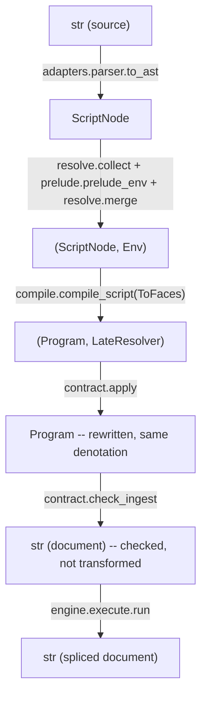
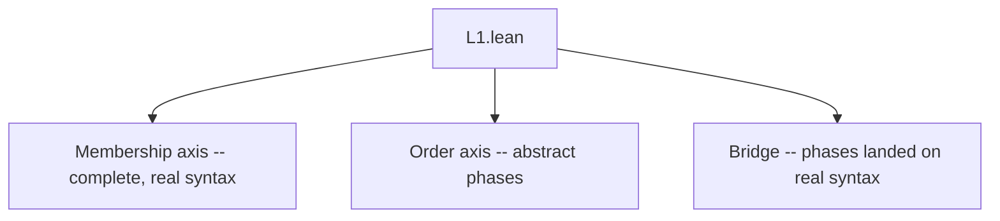

# Learning Hejmark -- the condensed edition

This is the eleven-lesson curriculum in `docs/learn/` (see its `README.md`), distilled into one document. It keeps every fact, cuts the repetition -- no more per-lesson recaps, exercises are down to the two or three that earn their place, and adjacent ideas that used to live in separate files are interwoven where they belong together. If a sentence here feels too fast, the multi-file version says the same thing slower with more worked examples. The specs themselves (`docs/foundation/L1.md`, `L1_5.md`, `L2.md`, `L3.md`, `docs/protocol.md`) are the ground truth when anything here and there disagree.

One naming note before anything else: the project and its package are **Hejmark** (`pyproject.toml`'s `name`, the `hejmark` CLI, this repository), but the *language itself* -- the specs, the grammar, the error classes (`HimarkScopeError`, `HimarkUnsettledError`, ...) -- still carries its older name, **Himark**. Both appear below; they mean the same thing.

Notation: Hejmark expressions are written in braces (`{a,b,c}`, `{a..z}`, `{cat}{dog}`, `{a,&{b}}`); math is LaTeX-ish ($\omega$ the first infinite ordinal, $\varepsilon_0$ a much larger one, $\omega^\omega$ in between); Lean code is transliterated to ASCII with a symbol legend where it appears, because the real `.lean` files use pretty Unicode this Markdown does not.

---

## Part I -- The language

### 1. The universe: one object, four words

Forget regular expressions. A regex is a predicate -- text in, yes/no out. Hejmark's mathematical floor, **L1**, denotes nothing about text at all; matching is a layer built *on top of* it (L1.5), the way a filesystem sits on top of a disk. L1 describes the disk.

The disk holds exactly one kind of object, a **universe**, built from four words the foundation doc (`docs/foundation/L1.md`) is fussy about:

- An **alphabet** is a list of abstract *concepts* -- an enormous virtual dictionary. You never see a concept directly, only how it's written.
- An **entry** is one concept, one row of the dictionary.
- A **face** is one way of writing an entry down. "Cat" and "feline" can be two faces of one entry: two spellings of the *same* meaning, not two related-but-distinct entries.
- A **spelling** is the literal string a face looks like -- `c`, `a`, `t`.

A **universe** is a **pointed alphabet**: the dictionary, plus a finger resting on one entry and one face of it. "Pointed" is math jargon for "a distinguished element"; here the finger has two coordinates, named `value` (which entry -- a position in the entry ordering, a natural number for a small dictionary, an ordinal in general) and `face` (which spelling of that entry -- an index, 0 for the **canonical** face). The pair `<value, face>` is the **capture** -- and when Hejmark eventually matches text and "captures" a group, this pair, present in the object from the start, is literally what gets captured.

Why point at all? Because a *written* universe leaves `value` free (the finger can land on any entry, so the expression stands for the whole collection); *matching* pins `value` to the entry that hit and `face` to the spelling that hit. The written form is a template with a sliding finger; a match freezes it. One more property worth internalizing early: **`face` never changes meaning** -- every face of an entry names the same concept, so `face` rests at 0 unless something specifically disturbs it (a subtraction that strips the canonical spelling, a fold whose later spelling is what hit). *Value ranges; face rests where value doesn't.*

Two degenerate universes, easy to get backwards:

| Written | Entries | Meaning | Order type |
| --- | --- | --- | --- |
| `{}` | none | the **empty** universe -- nothing to point at | $0$ |
| `{{}}` | one, faced by the empty spelling | the **unit** -- one entry with nothing written | $1$ |

`{}` is an empty library. `{{}}` is a library with one book whose spine is blank -- there *is* a book, it just has no title. Emptiness is meaningless, not invalid; it's a value, not an error. The unit is forced, not chosen: *fold* (next section) quotients faces onto one entry and is *total*, so folding over nothing still has to produce something -- one entry whose face is the concatenation of zero characters, the empty spelling. The unit is also the identity for *product* (multiplying by "one entry, no width" changes nothing), so `{{}}{cat}` = `{cat}`, exactly as $1 \times x = x$.

Last idea for this section, and the one that separates Hejmark from every string tool you know: **two entries can share a spelling and stay distinct.** Something has to decide who "owns" a contested spelling, since the finger can't ambiguously point at two rows reading the same three characters. That's the **collision rule**: the spelling belongs to the entry with the smaller `<value, face>` address (compared by value first, face as tiebreak), and every later claimant drops that spelling from its own faces. Membership is about entries and their faces; a shared spelling is a collision to adjudicate, not an identity. ("Shortlex" -- shorter spellings first, ties broken by character code -- is the order that makes "smaller address" well-defined; more on that below.)

### 2. Five constructors, one discipline

Every Hejmark expression, however baroque, is five operations composed. Not six, not four -- section 3 proves the count is forced.

**The one rule they all share:** no constructor ever rejects. Each is *total* -- a reversed range returns empty, a fold over nothing returns the unit, a self-reference that builds nothing returns empty. Contrast a parser, which spends half its code saying no. Saying no is a job for higher layers (L1.5, and really L2); the floor never has to reason about "what if this is malformed," because there is no malformed, only "what does this denote," and the answer always exists.

- **Union `,`** -- `{a, b, c}` appends entries, in order, skipping any already present. Idempotent, associative, **not commutative**: order defines `value`, and `value` is half the capture, so `{a,b}` and `{b,a}` are different objects even though they hold the same entries.
- **Subtraction `!{...}`** -- `{a..z, !{a,e,i,o,u}}` removes spellings, then renumbers. It acts on *spellings*, not entries directly: each operand spelling strips the one face claiming it; an entry losing every face disappears; a spelling naming nothing removes nothing (totality's no-op). On single-faced entries this looks like ordinary removal; on a fold it's a **face cut** (`{{cat,feline}, !{feline}}` survives as one entry now spelled only `cat`) -- subtraction is the constructor that reaches the face axis directly. It renumbers both axes afterward, so "canonical = index 0" always holds.
- **Fold `{...}` as a member** -- creates multi-faced entries. Depth flattens (`{a,{b,{c,C}}}` = `{a,{b,c,C}}`), and folding a *denotationally* empty operand yields the unit, not emptiness -- so `{{}}`, `{{z..a}}`, and `{{a,!{a}}}` are all the unit, because totality reads the operand's denotation, not its spelling.
- **Product, adjacency** -- `{cat}{dog}` builds tuples, one component per factor, spelled by concatenation, ordered by *positional value* (section 3). Empty factor gives empty universe; unit is the identity (`{{}}A` = `A`, which is also why `A^0` is well-formed as the unit). **Finite factors flatten** (`{cat}{dog}` = `{catdog}`, mere compression); an **infinite factor does not**, which is exactly why product is a real axiom.
- **Closure `&`** -- the self-reference token, legal anywhere a member or factor stands. It binds to the innermost enclosing brace (except a subtraction operand's own braces, which are never a binder), and denotes the **closure at $\omega$** of its body: stage $X_0$ is empty, $X_{k+1}$ is $X_k$ unioned with the body (reading `&` as $X_k$), entries ordered by first appearance. Trace `{a, &{b}}`: $X_1 = \{a\}$ ($\&$ was empty, times `{b}` is empty); $X_2 = \{a, ab\}$ ($\&$ is now $\{a\}$, times `{b}` is `ab`); then `abb`, `abbb`, ... -- order type $\omega$. Closure is the union rule read at $\omega$: it never retracts, so it always denotes *something*, totality again, now at infinity. Used as a member it *splices* (because closure is union, and union appends entry-wise); to fold it into one entry, brace it again. Boundary cases still denote: a subtracted `&` can't oscillate (`{{a,b,&{a,b}},!{&}}` places everything at stage 1); a bare `&` is the union no-op (`{a,&}` = `{a}`); an "unguarded fill" still converges because collision cleans up each pass (`{a,{{{},0}}&}` = `a, 0a, 00a, ...`). One limit, no continuation past it. This is what lets Hejmark express $a^n b^n$ (`{ab, {a}&{b}}`) -- the textbook language no finite-state machine can recognize.

**A retired constructor.** An earlier version of the language had a sixth axiom, "final segment" `{a..}` -- every spelling from `a` onward, forever. It's gone outright: the current spec's only range form is **bounded**, `{x..y}`, listing a finite shortlex interval at expansion time. Two things were always true, which is why the sixth constructor could be dropped without losing power: a range's endpoints must be *attained* spellings of a finite operand (an unbounded thing has no greatest element to close an interval with), and everything final segment denoted, the closure already denotes, written directly -- `{{{}}, &C}` (the unit closed under the code-point set `C`) generates *every spelling in shortlex order*, and a tail starting partway through is that closure with a bounded prefix subtracted off. So "everything from here on" is spelled with closure and subtraction, not a sixth axiom pretending to be a range. Practically: reach for `&` directly (often via the standard library's `str`, section 6) whenever you need something unbounded.

### 3. What the object forces

The constructors are verbs; these are the consequences nobody chose. Two need a small piece of new math.

**Ordinals, briefly.** Counting entries needs more than naturals once a universe is infinite, because you also care about *order*. An **ordinal** is the canonical shape of a well-order. $\omega$ is the type of the naturals under `<` -- "unbounded, but every element has only finitely many things below it." `{a,b,&{a,b}}` (the nonempty `ab`-strings; call it `N`, as the spec sometimes abbreviates) has type $\omega$. Beyond it: $\omega+1$ (something *after* all of $\omega$ -- genuinely bigger, unlike $1+\omega=\omega$, which just relabels the naturals); $\omega\cdot2$ (two full copies of $\omega$ back to back, the type of `{b,c}N`); $\omega^2$ ($\omega$ copies of $\omega$, `{b}N{b}N`); on up through towers to $\varepsilon_0$, the first ordinal with $\omega^{\varepsilon_0}=\varepsilon_0$ -- still countable, just enormous, and L1's exact ceiling. Two traps: addition and multiplication are *not* commutative here, and a finite left-multiplied into $\omega$ collapses ($n\cdot\omega=\omega$), which turns out to be load-bearing below.

**Positional value and the collision rule.** A product's tuple $p_0 \ldots p_{k-1}$, over factor order types $b_0, \ldots, b_{k-1}$, sits at $\sum_i W_i \cdot \mathrm{value}(p_i)$ with weight $W_i = b_{k-1}\cdots b_{i+1}$ -- most-significant term first, exactly a mixed-radix numeral (a car odometer if every wheel is base 10; a clock -- days, hours, minutes, seconds -- if the wheels differ). Finite factors give a plain natural product, and the order of multiplication is invisible to the count ($2\times3=3\times2$). Put an $\omega$ in a factor and that invisibility *fails*: $n\cdot\omega=\omega$ swallows any finite digit placed to its left, which is exactly why `NN` collapses to $\omega\cdot k$ below rather than climbing to $\omega^2$.

Concatenation isn't injective -- `{a,ab}{c,bc}` spells `abc` as both `(a,bc)` (value 1) and `(ab,c)` (value 2) -- so **one rule settles every collision**: the least `<value, face>` address claims the spelling, every later claimant drops it. Three flavors, one mechanism: *within one entry* (same value, lower face wins -- two fills both spelling `0` in `{{{},0}}{{{},0}}`); *across entries* (lower value wins -- the `abc` example); *cross-axis*, the one that catches everyone -- value dominates the face axis too, so **a canonical face can be the one that drops** (`{{{},0}}{0,00}`: the value-1 entry loses its index-0 face `00` to the value-0 entry, and renumbers to canonical `000`).

**Canonical numerals** -- a newer theorem, and the reason `where 8..12` can safely rewrite to the plain range `{8..12}` (section 5). Two orders -- *value* order and *spelling* (shortlex) order -- coincide on a radix's canonical numerals in two stages. Free, for any radix: first-appearance order under the numerals closure (`{0,{1..9,&{0..9}}}`) is *always* value order -- no premise about spellings needed. Premised, and this is the sharp part: value order and *spelling* order also coincide **only when** every digit is a single code point *and* digits stand in code-point order (no leading-zero numeral, so wider = larger; positional order reads digit by digit, exactly shortlex's tiebreak). Both premises genuinely bite: `{a,bb}` (a digit with a *wider* face) parts the two orders, since `bbaa` is value 4 but shortlex-below `bbbb`, which the value-ordered range never included.

**Bounded transfinitude.** Every order type is below $\varepsilon_0$, and the constructors are closed under it -- because every expression is finite, a finite climb from below the bound can't reach it. Stratified: closure-free stays finite; *linear* closure (at most one `&` per product, finite co-factors) reaches $\omega$ and stays below $\omega^\omega$ (`{b,c}N` is $\omega\cdot2$, `{b}N{b}N` is $\omega^2$); *nonlinear* closure spends the raised ceiling (`{{(}{b}N{)},{(}&&{)}}`, binary trees over $\omega$ leaves, squares its stage type each pass -- $\omega,\omega^2,\omega^4,\ldots$ -- landing at exactly $\omega^\omega$; no *finite* expression ever reaches $\varepsilon_0$). One more subtlety: **collision doesn't decide the type by itself** -- only the *surviving* least splits do. `{b}N{b}N`'s seams genuinely collide, yet every `b`-free-first-segment split is its own least split, cofinally many survive, and $\omega^2$ stands; `NN`'s least split instead pins the prefix to one character, only finitely many blocks survive, and the type *collapses* to $\omega\cdot k$. Same rule, opposite effect, depending on which splits survive.

**Fixpoint on settled bodies.** Closure denotes on every body (totality), but only *earns its name* on tame ones. `&` is **positive** when no subtraction operand encloses it (subtraction flips the monotonicity fixpoint reasoning needs); **guarded** when its product holds an `&`-free factor wearing no empty face -- every pass forced to add a real character. Positive body => the closure is a genuine *least fixpoint* (every constructor is continuous in a positive slot, so the staged construction *is* the fixpoint, not an approximation). Guarded body => a spelling of length $L$ settles (present or absent) by stage $L+1$ -- membership decided at a finite, computable stage, which is exactly what makes matching *decidable*. Unguarded/negative bodies still denote, but only *semi*-settle: presence shows eventually, absence carries no deadline -- classifying that boundary is L1.5's job; actually *refusing* to run past it is L2's (section 5).

**Compression, not capability.** Ranges and finite adjacency (plus, one layer up, splice/difference/intersection) add no power -- each expands into the five constructors, earning their keep the way `+=` earns its keep in a programming language. The closure of the unit under the code-point set generates every spelling in shortlex order, so the spelling order is *generated, not postulated*. The **admission test**: any construct enters as compression or as a genuinely new axiom, never a special case bolted on. Only **product** (refuses to compress over an infinite factor) and **closure** (refuses by power) sit on the axiom side -- every closure-free universe has a *regular* face set (a bounded range is a regular language, and the other four constructors preserve regularity), while `{ab,{a}&{b}}` denotes $a^nb^n$, famously not regular, so no closure-free arrangement can reach it. That's a real impossibility proof, not a design taste.

### 4. The surface: matching, names, definitions, registers, emit

**L1.5** is everything the host implements beyond denotation -- and it has its own totality-flavored rule: a surface construct expands into the five constructors, or it does not enter the language at all. There's no third option, no new denotation added here. Consequence worth naming: **a malformed script has no expansion** -- an unknown name, a bad arity -- decided once, at expansion time, the way a program that fails to typecheck simply isn't one. That's different in kind from *refusing a program that does compile*, which is entirely L2's job (section 5); L1.5 draws the line, L2 enforces it.

**Matching.** A **query** is a universe run against text, matching one entry by any face; an empty query matches nothing (meaningless, not invalid). **Membership** is the whole test -- does the text spell an entry, full stop, no ordinal semantics involved. **Longest-first** (maximal munch) breaks prefix ties; **zero-width** never matches (the unit's one face never counts). **Capture** is the `<value,face>` pair, read off a hit, never stored, never bolted on. **Scope**: the matcher only *decides* on the guarded fragment (section 3's fixpoint theorem); stepping outside is a diagnostic here, an actual runtime refusal in L2. **Back-references**: `{$k}` (pattern position) or `$k` (pipeline argument) reads factor `k` of the *same query*, strictly to its left -- late-bound expansion, substituting the face as it actually hit, turning every attempt into an ordinary floor query.

**Names.** `uni name = {...}` declares; `@name` splices wherever a universe can stand (the `@` sigil exists purely so a name is never mistaken for a literal face -- `{cat}` is a spelling, `{@cat}` is a reference). Splicing contributes entry-wise, the same rule closure already uses when spliced as a member. Names must be **acyclic** -- `&` is the *only* legal self-reference, and it lives on the floor, which is what guarantees every expansion terminates. Inside `{}`, every character (including whitespace and parens) is literal; a short list of structural characters (`, { } [ ] ! & @ _ ^ $ " \`) needs a `\` escape, and `\n`/`\t`/`\r` are mnemonic escapes.

**Definitions and the pipeline.** `def name params = body`, applied only through a bracketed pipeline: `A[f x g y]` runs stage `f` with argument `x`, feeds the result as `_` into stage `g` with argument `y`. Juxtaposition is *always* product, never application (`@a@b` is the product of two universes, not "apply `a` to `b`"), which is exactly why application needs its own bracket syntax. Substitution replaces parameters and `_`, and keeps expanding until only constructors remain; definitions are non-recursive and acyclic, so this always terminates. All stages inside *one* bracket share the same **head** (the pipeline's left operand); a *new* bracket rebinds it -- `A[f][g]`'s `g` sees `A[f]` as its head, which is how `pad` (section 6) reaches the *cut* radix's own `@0`. Numeral parameters split into **value** (canonicalized in the head's radix -- `aa` binds as `a`) and **count** (a plain decimal, feeding expander arithmetic, never a position). `A^x..y` compresses repetition -- the union of `A^x` through `A^y`, each an iterated product down to `A^0` = the unit -- and both ends must be attained, consistent with final segment's retirement: no open-ended `A^x..` either.

**Registers** -- the closed, deliberately tiny inventory of in-language spellings for reads the expander needs but nothing else computes:

| Spelling | Side | Reads |
| --- | --- | --- |
| `@` | expander | the pipeline head as a universe |
| `@0` | expander | the head's zero entry |
| `@lo..hi` | expander | the head's value line, cut by value (both bounds attained) |
| `$` | emitter | the hit as it hit |
| `$0` | emitter | the hit's canonical face |
| `$1..$n` | emitter | factor `k` of the query, as it hit |

No expression selects an entry by value except through `@lo..hi`, and both bounds are always written (mirroring final segment's retirement -- "every value" is the closure, written outright, never an open cut). A quick worked example: `{a,bb}[where a..bbbb]` denotes `a, bb, bba, bbbb` (values 0-3) -- a *spelling* range would also admit `bbaa` (value 4, shortlex-below `bbbb`), which is theorem 2's premise failing in the wild.

**Three axes, one register each.** Alphabet axis: keeping and dropping entries are both subtraction (difference drops named entries; intersection keeps them via $A\setminus(A\setminus B)$). Value axis: the closure generates the whole value line, and `where` is the pipeline spelling for cutting a bounded stretch out of it -- it never reads the threaded `_`, regenerating the line from the head fresh each time. Face axis: a fold can carry a *declared* respelling (an input spelling rides as a later face, output lands at face 0) with zero arithmetic -- but it cannot carry a **cast**, reading a bound value under a *different* radix (decimal to hex). No expression computes that and no register spells it; it's a documented, real gap, flagged as the one denotational capability a future surface layer might add (growing L1.5, not something L2 could unlock by loosening a budget).

**Emit** is the write half. A **text object** is anywhere spellings live (the document, or a template's string); a **branch** is a span carrying the capture that bound it -- only branches cross `=>`. A **statement** chains **steps**: a **query** step refines (tiles the branch, one sub-branch per hit; matching nothing stops that branch -- a mid-chain query is a *guard*); a **template** step constructs (`"literal {{interpolation}}"`, each site one capture read). A leading query branches into the document; a leading template is *detached* (the rest of the chain computes over a literal string, the real document untouched). **`<=>`, contraction**, iterates the ordinary pass to a fixpoint -- no declared measure, it settles when a pass changes nothing, and bounding a run that never does is entirely L2's.

**Sentinels** are declared names denoting one entry, one face: a fresh Unicode *noncharacter*, outside `char` and apart from every other sentinel. Because `char` (section 6) excludes noncharacters by construction, nothing written against it can ever accidentally match a sentinel -- collision with real content isn't avoided, it's *unrepresentable*, which is what makes "invisibly tag a spot in the text, then strip the tag later" a sound idiom rather than a hack.

**North star.** `static/examples/demos/bubble-sort.hmk` is the one script that only round-trips once sentinels, back-references, and contraction all work together:

```text
sentinel start
sentinel end

uni c      = {@char,!{\n}}
uni line   = {@c,&@c}
uni d      = {0..9}
uni digits = {@d,&@d}

{@line} => "{{@start}}{{$}}{{@end}}"
{@start,\,}{@digits}{\,}{0..9}[below 0..$2 padfree]{@end,\,} <=> "{{$1}}{{$4}},{{$2}}{{$5}}"
```

Pass one wraps every line in invisible `start`/`end` sentinels. Pass two (iterated) reads left to right: a start-or-comma, a number bound as `$2`, a comma, a *second* number constrained to be strictly less than `$2` by value (`below`, top-exclusive) regardless of leading-zero padding (`padfree` -- section 6), and an end-or-comma -- i.e., a genuine adjacent inversion. The template swaps the two numbers, threading the delimiters through unchanged. `<=>` repeats until no inversion remains, which for an adjacent swap is exactly "the line is sorted"; the top-exclusive `below` is what keeps a value-*equal* pair (`007,7`) from re-matching forever at a different padding. At exit, sentinels strip, leaving plain sorted text -- `3,1,2` -> `1,2,3`, and `09,3` -> `3,09` (value order, original padding preserved).

### 5. The contract that keeps it finite

L1 is total, L1.5 adds no rejection, and yet an unguarded `{a,&}` genuinely can spend forever deciding absence. **L2** is the layer that turns "this denotes, mathematically" into "and it finishes on your laptop" -- via rewrites that change *how* something computes without changing *what* it means, and refusals for the rest.

**Reach** prices a factor's longest possible face directly off the expression's *shape* -- a code point/range reaches 1, a literal its own length, a product the sum of its factors, a closure unbounded -- letting a product's split search (and the text scan) skip trying cuts that reach alone already rules out. It's always an *upper* bound (never claims something shorter than it might be, which would drop a real match); subtraction isn't priced at all, since stripping faces can only shrink. Where pieces must cover text *exactly* (a product's own membership question, a back-reference's re-split), reach is read from both ends.

**Value-cut collapse** cashes section 3's canonical-numerals theorem: where the premise holds (single-code-point digits, in code-point order), a value cut like `{a..z}[where c..g]` is provably identical to the plain range `{c..g}`, and the compiler rewrites accordingly rather than digit-walking something that was a contiguous interval all along. The premise is *checked*, not assumed -- `{a,bb}`'s wider-faced digit fails the check and keeps walking, correctly, just not for free.

**Sentinel boundary**, the operational half of section 4's masking idiom: the host allocates noncharacters from U+FDD0 up, in declaration order; the pool holds exactly 66, so a 67th declaration is refused; a document already spelling a noncharacter is refused at ingest (what makes the masking sound); every declared sentinel's face is stripped from the document on exit.

**Refusals** -- where a read or run can't complete in a stated bound, L2 declines with a diagnostic rather than hanging or guessing:

| Run | Refused when | Diagnostic |
| --- | --- | --- |
| membership in an unguarded closure | no stage settles it | `HimarkUnsettledError` |
| a canonical `$0`/factor `$k` read | past the read budget | `HimarkScopeError` |
| a value cut over an unbounded head | past the digit budget | `ValueLineError` |
| a match or contracting pass | past the work budget | `HimarkBudgetError` |
| a document at ingest, or a `sentinel` declaration | spells a noncharacter / pool of 66 exhausted | `HimarkSentinelError` |

A `<=>` that never settles gets no row of its own -- it's one metered run, so a pass that would spin forever just spends past the ordinary work budget. Guarded, precisely, once more: `&` in a product is guarded when *some sibling factor* can't spell the empty face, forcing every pass to lengthen; having a factor beside `&` isn't the same as having a guard.

**Two kinds of refusal, and the difference matters.** The unsettled refusal is **semantic** -- an engine answering "absent" there is *wrong*, not lenient, and the conformance corpus (section 8) pins this by letting `contains` answer `true`, `false`, or literally `"unsettled"`. The three budgets are **host choices** -- their *existence* is required, their *size* is each host's own business, and no conformance case fixes a number.

**Where obligations actually live** (not gathered into one file, but marked by the error class they raise):

| Obligation | Lives in |
| --- | --- |
| Reach | `core/floor/reach.py`, spent in `denote/split.py` and `scan/match.py` |
| Value-cut collapse | `compiler/valueline.py` + `core/contract.py` |
| Unguarded-closure membership | `denote/universe.py`, over `floor/binder.settled` |
| Read budget | `scan/capture.py` |
| Digit budget | `compiler/valueline.py` |
| Work budget | `engine/budget.py` |
| Sentinel pool and ingest | `compiler/resolve.py`, `core/contract.py` |

`core/contract.py` is L2's *seam* -- the one `Program -> Program` rewrite and the one ingest check with an actual call site -- but not its whole implementation.

### 6. The standard library

**L3** is `uni`/`def` declarations written entirely over the L1.5 surface -- no host code, no new denotation, every entry expanding into the five constructors, which is the admission test applied to a whole library. `char` (the writable alphabet, code points less noncharacters) is the one exception, host-seeded because "every code point" isn't something you'd type as a literal union.

| Entry | Definition | Denotes |
| --- | --- | --- |
| `char` | *host-seeded* | code points less the noncharacters |
| `hex` | `{0..9,a..f}` | the hex radix |
| `str` | `{{{}},&@char}` | every spelling, in shortlex |
| `fill` | `{{{},@0}}` | one entry, faced empty and `@0` |
| `shorter w` | `{_,!{@char^w_}}` | spellings narrower than `w` |
| `upto w` | `{_[shorter w],@char^w}` | spellings of width at most `w` |
| `longer w` | `{_,!{_[upto w]}}` | spellings wider than `w` |
| `where lo..hi` | `{@lo..hi}` | the value line cut by value |
| `below lo..hi` | `{@lo..hi,!{@hi..hi}}` | that cut, top-exclusive |
| `pad w..w'` | `{@fill^{w'}_,!{@str[shorter w]},!{@str[longer w']}}` | each entry filled with `@0` to width `w..w'` |
| `zeros` | `{{{}},&@0}` | the `@0`-runs of the head, empty included |
| `zfold` | `{{@zeros}}` | one entry wearing every `@0`-run |
| `padfree` | `{@zfold_}` | every entry at every `@0`-padding |

`str` is worth lingering on: it's literally section 2's "closure that used to need a sixth axiom," spelled once so nobody writes it by hand. `where` is a one-line wrapper over the `@lo..hi` register -- the surface keyword *is* the register, given a friendlier name. `pad`/`padfree` are pure face-axis work: `fill` doubles face count (not value count) each time it's multiplied on, the two subtractions strip whatever came out too narrow or too wide, and no arithmetic ever runs on the width itself. `padfree` refuses to cap that process -- `zeros` is `str` with `@0` standing in for `@char` (the closure of one code point, including none), `zfold` folds it into one infinite-faced entry, and the product with the operand hangs unbounded padding entirely on the face axis while the value axis never moves. That's exactly why `padfree` was the right tool for the bubble-sort comparison: "match at any face this entry wears" is precisely "any amount of padding," on the face axis, for free. (One real limit, mirroring section 4's cast gap: matching a `padfree` result stays decidable, but *canonically reading* one does not -- infinitely many faces has no well-defined "list them all," which is exactly the read section 5's read budget exists to refuse. `pad`'s capped form is what keeps a canonical read possible when you need one.) Width cuts (`shorter`/`upto`/`longer`) are exact only on *suffix-closed* operands, which is why the std always routes them through `@str` rather than the pipeline's current, possibly-not-suffix-closed operand.

---

## Part II -- The implementation

### 7. The pipeline

Source text becomes a rewritten document by way of `hejmark.run(source, text)`, the one call touching every stage:

| # | Stage | File | Does |
| --- | --- | --- | --- |
| 0 | Entry | `hejmark/__init__.py` | Public API; binds the parser once, fetches std-lib text |
| 1-2 | Grammar / codegen | `static/grammar/*.g4`, `adapters/antlr.py` | Hand-edited ANTLR grammar; shells out to `antlr4` |
| 3 | Std-lib fetch | `adapters/library.py` | Reads `static/std.hmk` once, cached |
| 4 | Parse -> AST | `adapters/parser.py` + `build.py` | ANTLR's tree becomes a `ScriptNode`. Last point any ANTLR type exists |
| 5 | Composition root | `core/driver.py` | Sequences everything below |
| 6 | Name environment | `core/compiler/{resolve,prelude,alphabet}.py` | Collect declarations, check acyclicity, seed `char`, merge std-lib -> `Env` |
| 7 | Lowering | `core/compiler/{compile,expand,valueline,late}.py` | Surface -> five constructors; back-references -> a `SlotTable` -> `Program` + `LateResolver` |
| 8 | L2 contract | `core/contract.py` | `apply()` (value-cut collapse) + `check_ingest()` (sentinel refusal) |
| 9 | Engine | `core/engine/execute.py` + `scan/{match,capture}.py` | Runs the program, denoting via `denote/universe.py` |
| 10 | Output | `driver.run()` | The spliced document (or a `Match`/iterator for `match`/`finditer`) |



Two payloads never mix: a whole-script `Program` (for `run`) and a single-expression `Query` (for `parse`/`match`/`finditer`) come from different compiler functions and different engine entry points -- and `parse`/`match`/`finditer` stop after stage 7, **skipping `contract.py` entirely**: no document to ingest-check, no program-level rewrite worth doing for one expression.

**The hard line: compiler and engine never import each other.** Enforced by `import-linter` in CI, not convention. `core/driver.py` is the *only* module that sees both, wiring them through an injected `Adapters(to_ast, engine)` bundle -- the engine arrives as a `Protocol` port, never a concrete class the compiler names. Why bother: the stated direction of travel is an out-of-process engine in another language eventually replacing this one, Python keeping only parse/compile. A hard boundary today is what makes that swap possible tomorrow.

Two things genuinely *do* cross it, in opposite directions, as callback values `driver.py` injects -- never as imports:

- **`LateResolver`** -- a back-reference (`$k`) can't be lowered ahead of its binding, so the compiler leaves a numbered *slot* and hands the engine a callback: "once bound, call me with the faces, I'll return the floor universe they expand to." The engine calls this at match time, re-entering the compiler's own expansion.
- **`ToFaces`** -- `@0` and value cuts are *defined* as a bounded read of a denotation, and reading one is the engine's job. The compiler is handed a lazy callback (`canonical_faces`, implemented by `denote/universe.py`) that streams canonical faces on demand, called at expansion time.

This wasn't assumed unavoidable, it was checked: a back-reference read appears in exactly three grammar positions, and only one is content-independent -- a value-bound read parses as a numeral in the head's radix, a pipeline-argument read can land on an exponent count, changing the expanded node's very *shape*. Moving that into the engine would mean moving most of L1.5 there, against the rule that the engine stays "dumb about the language": it denotes and matches, never parses or expands.

The rest of the stack is layered the same way (`import-linter` contracts, `pyproject.toml`): `hejmark`: `cli -> adapters -> core`; `core`: `driver -> {compiler | engine | contract} -> ir -> floor`; `core/engine`: `service -> execute -> scan -> denote -> budget`; `core/engine/denote`: `universe -> split -> window -> order`. Denotation is **engine-owned**, not shared -- it lives under `engine/denote/` because denoting a floor tree is what executing it requires, while `core/floor/` stays data-only. `budget.py` sits at the bottom of the engine stack because L2's work meter is charged at the one place every run funnels through -- the membership question, denotation's own chokepoint -- even though the runs that *open* a budget live further up.

One repo-wide convention worth knowing: every module under `hejmark/` defining a top-level function or class needs a mirror test under `tests/unit/`, enforced as a pytest gate alongside `ruff`/`ty`/`import-linter`/`vulture`/`ast-grep` and a 400-line module cap -- what actually makes the compiler/engine boundary above an enforced fact rather than a comment nobody re-checks.

### 8. A second engine, in another language

`docs/protocol.md` specifies what any engine outside this process must do; `rust/` satisfies it, has never seen a `.hmk` file, and shares no code with the Python compiler. Only JSON crosses (faces and template text as **code-point arrays**, not native strings, because a JSON string can't hold a lone surrogate and shortlex runs over the whole code space).

**Four verbs, one exception:**

| Verb | Direction | When |
| --- | --- | --- |
| `run(program, document) -> document` | host -> engine | execution |
| `zero(universe) -> face \| null` | compiler -> engine | compilation (`@0`) |
| `digits(universe) -> [face]` | compiler -> engine | compilation (a value cut's radix) |
| `resolve(slot, faces) -> universe` | engine -> compiler | execution (a back-reference) |

`resolve` is the one break in interchangeability -- a back-reference can't be lowered ahead of its binding, so it crosses as a slot and the engine calls back into the compiler.

**Why this has to be re-entrant.** `resolve` re-enters expansion, which can call `zero`/`digits` again, while the original `run` is still outstanding waiting for an answer (on the bubble-sort demo, roughly seven nested calls per `resolve`). An ordinary client that blocks for a reply cannot service an inbound call while its own outbound one is open -- it deadlocks. The fix: **both ends run the exact same loop** (`adapters/channel.py`, `rust/src/channel.rs`), and "waiting for an answer" is just that loop with a different stopping condition. This is why the codebase insists on one symmetric `Channel` class rather than a client half and a server half -- splitting it that way is exactly the shape that deadlocks. `resolve` is memoized on the faces it reads (traffic tracks *distinct bindings*, not document length -- measured at 4/6/6/10 calls for 4/8/16/32-item inputs); `digits` on an unbounded universe must hang or refuse, never invent a truncated radix.

**The wire**: one JSON object per line, both directions -- `{"id":1,"verb":"run","params":{...}}` answered by `{"id":1,"ok":{...}}` or `{"id":1,"error":{"category":"...","message":"..."}}`. Ids are per-direction; anything malformed ends the conversation rather than being repaired.

**Division of labor:**

| The engine owns | The host/compiler owns |
| --- | --- |
| Denotation: membership, entries, collision | Parsing, name resolution, L1.5 expansion |
| Matching, capture binding (`$`, `$0`, `$k`) | Sentinel allocation and `{{@name}}` resolution |
| Stripping sentinel faces on exit | Lowering to the payload, and `resolve` |
| L2's *run-time* refusals | L2's *rewrites*, already applied before shipping |

Sentinel names never cross the wire (the compiler substitutes faces while lowering); the captures aren't the matcher's raw pieces (the floor's collision rule already decided ownership before `$k` reads it). **Errors**, five categories matching section 5's refusals plus one wire-only case: `payload` (JSON didn't decode -- refuse, never repair), `scope`, `sentinel`, `unsettled` (semantic, per section 5), `budget` (a host choice, per section 5).

**Conformance**: `static/conformance/*.json` carries lowered payloads beside expected answers, checked two ways -- decode-and-run, and re-derivation from source to prove the file isn't stale. The catch for anyone writing a third engine: the protocol only has verbs for `run`/`zero`/`digits`, none for raw entries or membership, so the corpus's `denote`/`match` suites **cannot be asked over a wire at all** -- a real port has to read the JSON natively (`rust/tests/conformance.rs` is the worked example), and `tests/integration/test_transport.py` checks the complementary half over a real pipe (`HEJMARK_ENGINE='<command>'` points it anywhere).

**`rust/`** has no parser, no compiler -- just a close, deliberately function-for-function port of `hejmark/core/engine/` (each file's header names its Python counterpart, so the two can be diffed by eye when the corpus disagrees). Two discoveries, not up-front choices: a spelling is `Rc<[u32]>`, never `String` (same reason as the wire -- `char` can't hold a lone surrogate); the arena grows *during* a run, because `resolve` mints a floor universe that didn't exist at decode time and it has to land where denotation is already reading. `cargo test`, reading the corpus directly, is the gate that actually constrains this engine -- the wire alone would miss a broken collision rule entirely.

---

## Part III -- The proof

`static/lean/L1/` is a Lean 4 mechanization of L1 -- a second, independently-checked source of truth, not sample code. This part moves fast; it's optional, and rewards having Parts I-II solid first.

### 9. Lean in a hurry

A proof assistant is a type checker pushed to its limit: "types" can be full mathematical statements, and a "value" of that type is a *proof*, checked mechanically by a small trusted kernel. **Propositions as types** is the one idea everything rests on: `A -> B` is the function type from proofs-of-A to proofs-of-B (implication *is* a function); `A /\ B` is a pair; `A \/ B` a tagged union; `forall x, P x` a dependent function; `exists x, P x` a dependent pair bundling a witness with its proof. "Prove the theorem" means "construct a term of this type," so proving is programming (Curry-Howard).

Small proofs are written directly (**term mode**); bigger ones drop into **tactic mode** (`by ...`), issuing commands that transform a goal state until it's discharged: `intro h` (assume a hypothesis), `exact e` (this term closes the goal), `apply f` (work backwards), `refine e` (like `exact` but with `?_` holes as new goals), `obtain`/`rintro`/`rcases` (destructure), `cases`/`induction` (split on shape), `simp` (rewrite via a lemma database), `omega` (linear arithmetic over `Nat`/`Int`, closing an enormous amount of index bookkeeping in this tree), `ring` (commutative-ring identities).

A relation is **well-founded** when no infinite descending chain exists -- the property that validates induction, and (via `WellFounded.min`, giving the *least* element of any nonempty set) exactly how "the least address claiming a spelling" becomes a concrete, provably-unique object. Proving "this has order type $\omega$" is always the same play: build an explicit **order isomorphism** (`RelIso`, a bijection preserving order both directions) onto a known model (`Nat` for $\omega$, `Fin n` for the finite type $n$) -- order type is invariant under such maps, so the conclusion is free once the isomorphism exists.

**"Honestly axiom-free"** means something specific: Lean's own foundations rest on three trusted axioms (`propext`, `Classical.choice`, `Quot.sound`), so the honesty bar is that a headline theorem's `#print axioms` output is a *subset* of exactly those three, with no `sorry` and no locally postulated `axiom` anywhere in the tree. `native_decide` (compiled-computation) proofs rest on one further axiom and are deliberately fenced out of that gate.

### 10. Reading the mechanization

Build with `lake build` from `static/lean/`; `uv run pytest -k lean` wraps three gates -- the build itself, every headline theorem's axiom footprint, and a `sorry`/`axiom` text-scan across the whole tree (loudly required unless `HEJMARK_SKIP_LEAN=1`).

L1 has two axes with very different proof difficulty. The **membership axis** -- *which spellings does a universe wear* -- is pure structural set algebra (collision moves ownership, never membership), and is mechanized *completely* against the real syntax: `Spelling.lean` (shortlex, windows) -> `Syntax.lean` (the five constructors as one inductive) -> `Semantics.lean` (the Prop-valued denotation) -> `Laws.lean` (compression laws, including the closure-generates-every-spelling theorem) -> `Evaluator.lean`/`Completeness.lean` (a Bool-valued matcher, sound and -- on a well-behaved fragment -- exactly complete) -> `Settling.lean` (the guarded settling bound, the deepest proof in the tree) -> `NorthStar.lean` (every row of the doc's table, machine-checked) -> `Fixpoint.lean`/`Admission.lean` (the positive-fixpoint and admission-test theorems).

The **order axis** -- *what order type* -- is mechanized as self-contained abstract phases, each an explicit model rather than the real syntax: shortlex-over-a-finite-alphabet-is-$\omega$; positional value is mixed radix; collision ownership is well-defined; the transfinite ceiling stays below $\varepsilon_0$; first-appearance enumeration fits in one limit; collision alone doesn't decide the type; and (newest) the canonical-numerals theorem's abstract half. `L1/Bridge/` is where the two axes meet -- an ordinal-valued entries enumeration on real terms, a body-recursive within-body order, and the transfinite rows read off it, landing every abstract phase on actual syntax up through $\omega^\omega$ and the numerals north-star row.



Three items stay permanently deferred (each a research increment, not a gap): the n-ary generalization of the positional product laws (proved for the binary form, which is all the real rows need); the *converse* of the admission test (closure-free implies regular -- the direction that matters, ruling compression out, *is* proved); and the ordinal-level face axis on real syntax. Two approximations are documented, not accidental: the evaluator under-approximates unsettled closures (matching Python's `HimarkUnsettledError` rather than guessing), and treats fold-emptiness with a sound surrogate that misses one boundary case (`{{a,!{a}}}`'s empty face) -- no north-star row is affected by either.

### 11. The order-axis proofs, up close

The first three order-axis files run one shared play, worth knowing even without reading a line of Lean: define an explicit numbering into a known model, prove it preserves order, prove it's a bijection, package both as an order isomorphism, read off the ordinal.

**`Order.lean`** numbers a finite-alphabet spelling as `lenOffset(length) + lexIndex(digits)` -- which block (by length) plus where within it (a base-`(m+1)` numeral) -- reuses Mathlib's `List.Shortlex` for well-foundedness rather than hand-rolling it, and lands `finShortlex_type_omega0` by isomorphism onto `(Nat, <)`.

**`Positional.lean`** generalizes that numbering to mixed radix over a *list* of factor radices (`mixedRadix`, Horner's rule -- a leading digit weighted by the product of every radix to its right, exactly the clock/odometer picture), with tuples carried as a subtype bundling the validity proof (each digit below its own radix). The headline `positional_value_type` lands by isomorphism onto `Fin (bs.prod)`.

**`Collision.lean`** needs no isomorphism at all -- just a well-order to minimize over. An `Address` is `Ordinal ×ₗ Nat` (value dominates, face breaks ties, lexicographically); `collision_settled` takes the well-founded minimum of every address sharing a spelling and proves it's the *unique* survivor, via `WellFounded.min` plus an antisymmetry argument for uniqueness. Three one-line corollaries then check the lex order resolves each of section 3's three collision flavors, including the cross-axis one where a canonical face is the one that drops.

The remaining phases play the same game at higher altitude -- `Transfinitude.lean` up to the $\varepsilon_0$ ceiling, `Enumeration.lean` pinning first appearance inside one limit, `Collapse.lean` proving both halves of "collision doesn't decide the type," `Numerals.lean` landing the canonical-numerals theorem -- and `L1/Bridge/` lands all of it on real syntax.

---

That's the whole project: an object with five ways to build it and theorems nobody chose (Part I); a compiler and two independent engines that agree on what those theorems say, connected by a protocol precise about the one place they can't stay independent (Part II); and a machine-checked proof, in a second language entirely, that the theorems are actually true (Part III). The multi-file `docs/learn/` lessons say all of this again, slower, with more exercises and worked derivations, if any single section here moved too fast.
