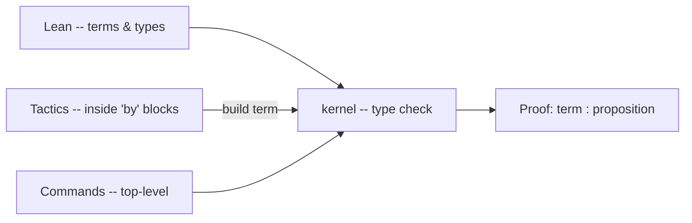

# Lean 4 Cheat Sheet

**Target:** Lean 4 | **Status:** Reference | **Scope:** terms, commands, tactics

## :jigsaw: Model

Lean 4 is three languages stacked, sharing one file:

- **Lean** -- the **term** language. Types, functions, inductive definitions, and proofs are all terms.
- **Commands** -- the **command** language (declarative, keyword-driven): `def`, `theorem`, `inductive`, `import`, `open`.
- **Tactics** -- the **tactic** language inside `by` blocks that builds proof terms interactively.

The engine is a **type checker**. Under the **Curry-Howard** correspondence a proposition **is** a type and a proof **is** a term of that type; "proving `P`" means "constructing a term of type `P`", and compilation succeeds exactly when that term type-checks.

$$\text{proposition} = \text{type} \qquad \text{proof} = \text{term}$$

Interactive proof is a **goal / tactic** loop: you hold a **proof state** (hypotheses `⊢` goal), each tactic transforms it, and the proof closes when no goals remain.



______________________________________________________________________

## :page_facing_up: Commands

| Command                 | Does                                                  |
| ----------------------- | ----------------------------------------------------- |
| `def f x := e`          | define a value / function                             |
| `def f : Nat → Nat`     | define a recursive function by pattern matching (\`   |
| `inductive T where ...` | declare an inductive type / proposition               |
| `structure S where ...` | define a structure (record / class)                   |
| `theorem`/`lemma`       | state a goal to prove (all synonyms)                  |
| `by ...`                | open a tactic-style proof                             |
| `#check e`              | print the type of `e`                                 |
| `#print x`              | print a definition or metadata                        |
| `#eval e` / `#reduce e` | evaluate a term (interpreter / kernel reduction)      |
| `import M`              | load a module (e.g. `import Mathlib.Tactic.Linarith`) |
| `section S. ... end S.` | scope shared `variable` declarations                  |

```lean
import Mathlib.Tactic.Linarith    -- linear arithmetic
import Mathlib.Tactic.Ring        -- ring solver

```

______________________________________________________________________

## :abacus: Lean -- terms

```lean
def add1 (n : Nat) : Nat := n + 1
def apply {A B : Type} (f : A → B) (x : A) : B := f x   -- {..} implicit

def length {A : Type} : List A → Nat
  | []      => 0
  | _ :: xs => (length xs).succ

inductive Tree (A : Type) where
  | leaf : Tree A
  | node : Tree A → A → Tree A → Tree A

```

| Form                           | Meaning                                                                 |
| ------------------------------ | ----------------------------------------------------------------------- |
| `fun x => e`                   | anonymous function (lambda); also written as `$\lambda$ x => e`         |
| `$\forall$ x : T, U`           | dependent function type (Pi); `$\rightarrow$` is the non-dependent case |
| `A $\rightarrow$ B`            | function type -- also implication                                       |
| `let x := e; body`             | local binding                                                           |
| `match e with ...`             | pattern match / case analysis                                           |
| `A $\times$ B`, `A $\oplus$ B` | product, sum types                                                      |
| `{ x : T // P x }`             | subtype                                                                 |
| `@f`                           | supply implicit args explicitly                                         |

**Inductives** define data (like `Nat`, `List`) and propositions (like `LessEq`, `Exists`) uniformly -- constructors are the introduction rules; `match` / `cases` / `induction` are the elimination rules.

______________________________________________________________________

## :symbols: Sorts and universes

Every type has a **sort**. The three heads:

| Sort     | Inhabitants are        | Notes                                                                 |
| -------- | ---------------------- | --------------------------------------------------------------------- |
| `Prop`   | proofs of propositions | impredicative; **restricted** elimination; proof-irrelevant in spirit |
| `Type u` | computational data     | predicative small types (`Type` is shorthand for `Type 0`)            |
| `Sort u` | universes              | `Prop` is `Sort 0`, `Type u` is `Sort (u+1)`                          |

The hierarchy is cumulative and stratified to stay consistent:

$$\mathsf{Prop} = \mathsf{Sort}\ 0 \qquad \mathsf{Type}\ u = \mathsf{Sort}\ (u+1) \qquad \mathsf{Type}\ u : \mathsf{Type}\ (u+1)$$

`Prop` vs `Type` is the key modeling choice: put a fact in `Prop` when only its **provability** matters and it should be erased at extraction; put it in `Type` when you need to **compute** with the witness.

______________________________________________________________________

## :scroll: Propositions -- Curry-Howard

| Logic          | Lean                | Type-theoretic reading                         | Intro / elim tactics                                            |
| -------------- | ------------------- | ---------------------------------------------- | --------------------------------------------------------------- |
| implication    | `P $\rightarrow$ Q` | function type                                  | `intro` / `apply`                                               |
| conjunction    | `P $\land$ Q`       | pair (`And`, ctor `And.intro`)                 | `constructor` or `$\langle$h1, h2$\rangle$` / `rcases`, `cases` |
| disjunction    | `P $\lor$ Q`        | sum (`Or`, ctors `Or.inl`, `Or.inr`)           | `left`, `right` (or `Or.inl`, `Or.inr`) / `rcases`, `cases`     |
| negation       | `$\neg$ P`          | `P $\rightarrow$ False`                        | `intro` / `contradiction`                                       |
| for all        | `$\forall$ x, P`    | dependent function (Pi)                        | `intro` / `apply`, `specialize`                                 |
| exists         | `$\exists$ x, P`    | dependent pair (`Exists`, ctor `Exists.intro`) | `use t` or `$\langle$t, h$\rangle$` / `rcases`, `cases`         |
| equality       | `x = y`             | `Eq` inductive (`Eq.refl`)                     | `rfl` / `rw`, `subst`                                           |
| truth / absurd | `True` / `False`    | unit / empty type                              | `trivial` / `contradiction`, `exfalso`                          |

______________________________________________________________________

## :hammer: Tactics -- the workhorses

### Move things into context / discharge goals

| Tactic               | Effect                                                    |
| -------------------- | --------------------------------------------------------- |
| `intro x` / `intros` | move `$\forall$`/`$\rightarrow$` premises into hypotheses |
| `apply H`            | backward reasoning: match `H`'s conclusion to the goal    |
| `exact t`            | give the proof term directly                              |
| `assumption`         | goal is one of the hypotheses verbatim                    |
| `refine e`           | give a term with `?_` or `_` holes left as new goals      |
| `exfalso`            | replace goal with `False` (prove anything from absurdity) |

#### Case analysis and induction

| Tactic              | Effect                                                            |
| ------------------- | ----------------------------------------------------------------- |
| `cases x`           | split on the constructors of `x` (no IH)                          |
| `rcases x with ...` | split and patterns-destruct hypotheses forward (requires Mathlib) |
| `induction x`       | like `cases` but with induction hypotheses                        |
| `injection H`       | use constructor injectivity to get argument equalities            |
| `contradiction`     | close a goal from conflicting/false hypotheses                    |

#### Equality and rewriting

| Tactic                           | Effect                                                   |
| -------------------------------- | -------------------------------------------------------- |
| `rfl`                            | prove `x = x` (up to conversion / definitional equality) |
| `rw [H]` / `rw [$\leftarrow$ H]` | rewrite goal left-to-right / right-to-left with `H`      |
| `rw [H] at H2`                   | rewrite inside a hypothesis                              |
| `symm` / `trans`                 | flip / chain an equality                                 |
| `subst x`                        | eliminate a variable given `x = e`                       |

#### Conversion / unfolding

`simp`, `dsimp`, `unfold f`, `change T` -- reduce or re-view the goal without changing its meaning. `simp` is the primary simplification engine.

#### Connective intro

`constructor` (`$\land$`), `left` / `right` (`$\lor$`), `use t` (existential).

#### Building forward

| Tactic                                 | Effect                                                         |
| -------------------------------------- | -------------------------------------------------------------- |
| `have H : P := e`                      | prove `P` as a local hypothesis using tactic block or term `e` |
| `let x := e`                           | define a local variable                                        |
| `specialize H t`                       | instantiate a hypothesis                                       |
| `generalize h : e = x`                 | replace expression `e` with variable `x`                       |
| `obtain $\langle$h1, h2$\rangle$ := H` | destructure a hypothesis forward (requires Mathlib)            |

#### Automation

`simp` (simplification library), `aesop` (search-driven proof automation), `omega` (linear integer/Nat arithmetic), `linarith` (linear real/rational inequalities), `ring` / `field` (algebraic normalization), `tauto` (propositional logic).

______________________________________________________________________

## :link: Tacticals and Tactic Combinators

In Lean 4, tactics are structured inside a `by` block:

| Form          | Meaning                                       |
| ------------- | --------------------------------------------- |
| `t1 <;> t2`   | run `t2` on **all** subgoals produced by `t1` |
| `try t`       | run `t`, ignore failure                       |
| `repeat t`    | run `t` until it fails or makes no progress   |
| \`first       | t1                                            |
| `all_goals t` | run `t` on all open subgoals                  |
| `any_goals t` | run `t` on all subgoals where it succeeds     |

**Macros** allow writing custom tactic abstractions:

```lean
macro "inv" h:ident : tactic => `(tactic| (cases $h; subst_vars))

```

______________________________________________________________________

## :white_check_mark: A worked proof

State a goal, drive the proof state until no goals remain, and seal with a tactic block. This proof uses the built-in `Nat` representation:

```lean
theorem zero_add (n : Nat) : 0 + n = n := by
  induction n with
  | zero => rfl                      -- base: 0 + 0 = 0 (definitional)
  | succ k ih =>
    -- step: 0 + succ k = succ k
    -- Lean normalizes 0 + succ k to succ (0 + k) definitionally
    rw [ih]                          -- rewrite with IH: 0 + k = k

```

Read it as: perform induction on `n`. The base case `zero` is solved by definitional equality (`rfl`). For the step case `succ k`, Lean definitionally reduces `0 + (k + 1)` to `(0 + k) + 1`. We rewrite this subterm using the induction hypothesis `ih` (`0 + k = k`), leaving `succ k = succ k` which is solved.

______________________________________________________________________

## :warning: Gotchas

- **Strict positivity.** Inductive types cannot contain negative occurrences of themselves (e.g. as function arguments to constructors) to avoid logical inconsistencies like Russell's paradox.
- **Termination.** Recursive functions must be proven structurally decreasing. Non-structural recursion requires a `termination_by` clause, or the `partial` keyword (which disables proof generation).
- **`Prop` elimination is restricted.** You cannot pattern-match a `Prop` (like `$\exists$` or `$\lor$`) to construct a value in `Type` unless it is a singleton/empty proposition. This is critical for proof erasure.
- **Definitional vs. Propositional.** Lean distinguishes between definitional equality (proven by `rfl`) and propositional equality (requires `rw`). If `rfl` fails, check your definition's reduction steps.
- **Mathlib Imports.** A heavy Lean project needs a precompiled Mathlib cache. Run `lake exe cache get` in your project directory to avoid rebuilding Mathlib from source.
- **Implicit Arguments.** If Lean fails to unify implicit arguments, write `@f` to make all arguments explicit, or use `_` to ask Lean to infer specific terms.
- **Axioms and sorry.** A `sorry` compiles but leaves the proof incomplete. Use `#print axioms my_theorem` to inspect the underlying assumptions of your proof.
